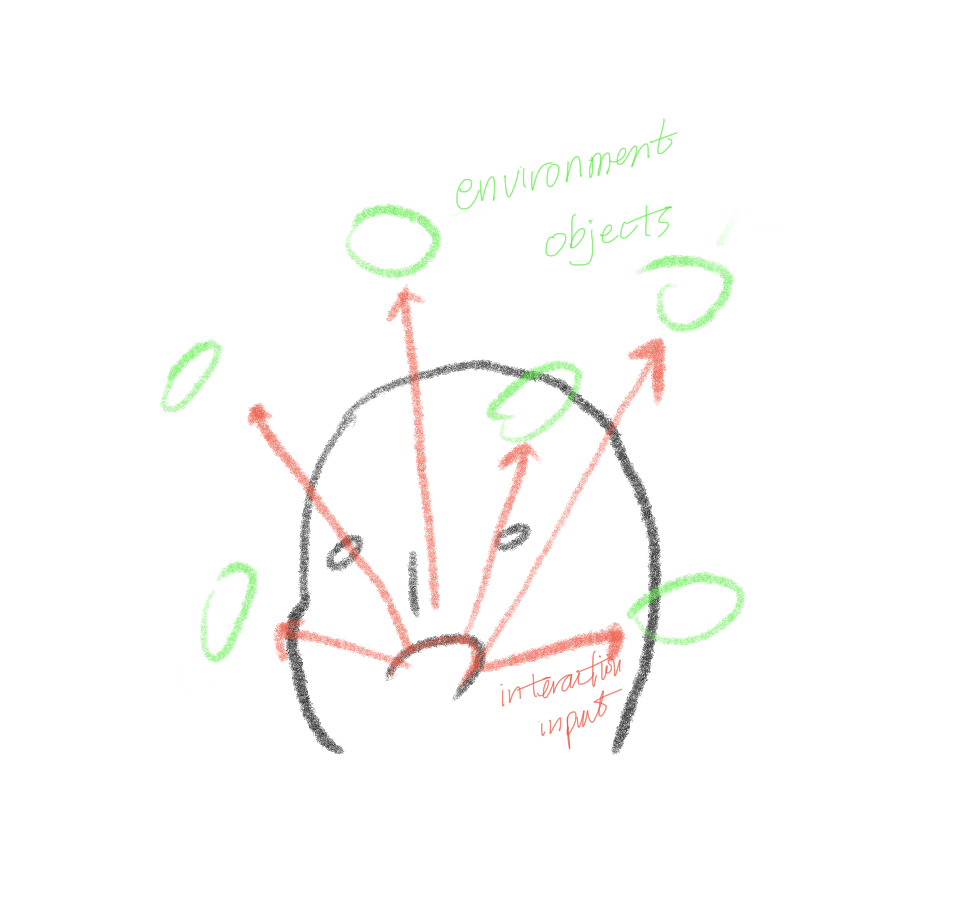

# AR Face Filters

<em><strong><a href="https://github.com/youjinChung/SnapLens">GitHub Repo</a></strong></em> <em>Snapchat interview project</em>

# Blow A Kiss: AR experience with Unity MARS

<iframe src="https://player.vimeo.com/video/678667262" allowfullscreen></iframe>

### Instruction

1\. Open your mouth to blow a kiss!
2\. Target the heart to spin it faster!
3\. Wink to change the color of the heart!

### Process

#### Idea

I had an initial idea to make an AR effect that users can interact with the environment object with the user's interaction input. Most users hold a phone while playing AR apps. So I avoided touch input, using the most accessible interaction inputs, opening mouth, and closing eyes.

Once I decided on facial expressions for interaction, I could come up with the idea of kiss and wink. The idea moved to the 'Face Blowing a Kiss 😘' emoji and the look and feel of the AR effect. On top of that, it would go along with the romantic effects of Valentine's day.

#### Structure

Unity provides complete access to components of the development, compared to Spark AR or Lens Studio. Even though Spark AR and Lens Studio provide better features focusing on AR effects development, they aim at patch/block-based development. That limits control over elements while programming. I found that Unity MARS can also provide essential features for AR effect making, such as face landmark tracking and facial expression events. So decided to work on Unity MARS for the project.

### Trial & Errors

#### AR Face Mask
I made a reflective mask on the detected facial mesh. I intended to show the light change on the face according to the interaction input. It worked with existing project dependency and setting. However, the facial mesh edge was too distinctive compared to other commercial AR filters; you can see the border of the forehead and chin. I decided not to include this effect in this project.

#### Reflection Probe in AR
I tried to include reflection probes for a more realistic visual effect in the scene. However, the AR reflection probe only worked with the rear camera. I could not adopt it for the front user camera scenario.

### Further Steps

New interaction input for world AR scenario. 
I'd like to try body pose input, location of people, GPS, and landmark anchoring.

### Assets Credit

[Cartoon Kiss_cjohnstone.wav, trijohnstone, Freesound](https://freesound.org/people/trijohnstone/sounds/536335/) 
[Heart Symbol Low Poly Free low-poly 3D model, VARRRG, Cgtrader](https://www.cgtrader.com/free-3d-models/character/anatomy/love-low-poly) 
[3D model heart, honyzirbu, Turbosquid](https://www.turbosquid.com/3d-models/3d-model-heart-shape-1596418)

---

# Snapchat Lenses

### [Neon Party](https://www.snapchat.com/unlock/?type=SNAPCODE&uuid=c50bce3e055947ad966780105402b903&metadata=01)

<iframe src="https://player.vimeo.com/video/373539730" frameborder="0" allow="autoplay; fullscreen; picture-in-picture" allowfullscreen></iframe>

Neon light moves according to face position.
The lights on the depth mask works like face painting.

### [Whack-A-Mole](https://www.snapchat.com/unlock/?type=SNAPCODE&uuid=76ca291399c2406aa09ccb4b724310fa&metadata=01)

<iframe src="https://player.vimeo.com/video/373539135" frameborder="0" allow="autoplay; fullscreen; picture-in-picture" allowfullscreen></iframe>

Whack-a-mole game using rear camera.
1. User can position moles before game starts
2. Whack a randomly jumping mole
3. Highscore tracked.

### Role

Concept, Programming, Design

### Credit

[Mole](https://thenounproject.com/search/?q=whack%20a%20mole&i=1946079) by [Eucalyp](https://thenounproject.com/eucalyp/) from the Noun Project (royalty paid) 
[Skate](https://www.freemusicarchive.org/music/Komiku/Captain_Glouglous_Incredible_Week_Soundtrack/Skate) by [Komiku](https://www.freemusicarchive.org/music/Komiku/) 
[SFX UI Button Click](https://freesound.org/people/suntemple/sounds/253168/#) by [suntemple](https://freesound.org/people/suntemple/) 
[Retro Bonus Pickup SFX](https://freesound.org/people/suntemple/sounds/253172/#) by [suntemple](https://freesound.org/people/suntemple/) 
[Referee whistle blow, gymnasium.wav](https://freesound.org/people/SpliceSound/sounds/218318/#) by [SpliceSound](https://freesound.org/people/SpliceSound/)
