# Final

  
0.Package Design Update  
  
Printed out the illustrations of the creatures, and laser-cut ear template for
display. Meanwhile, wax polished resin stone, so it is more smooth and shiny.  

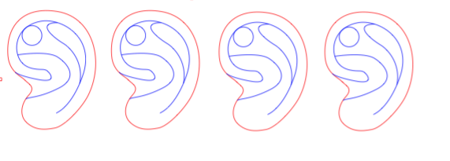

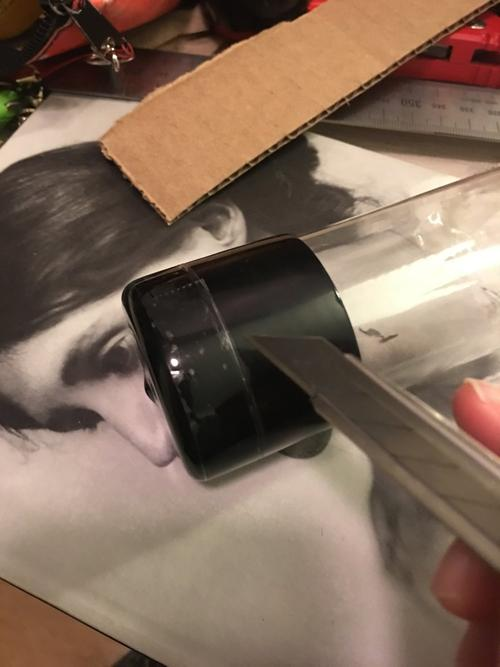

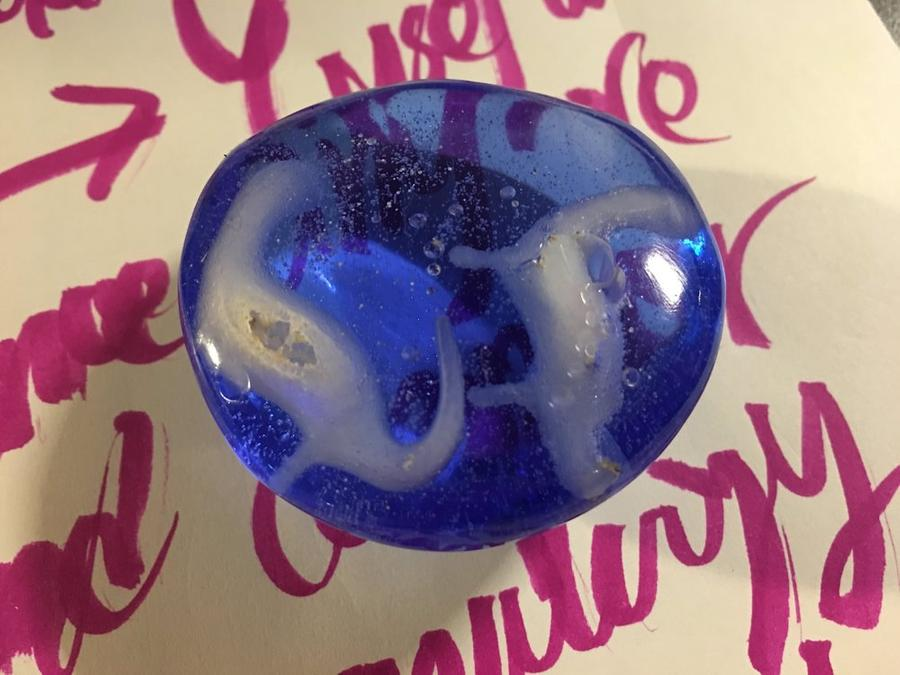

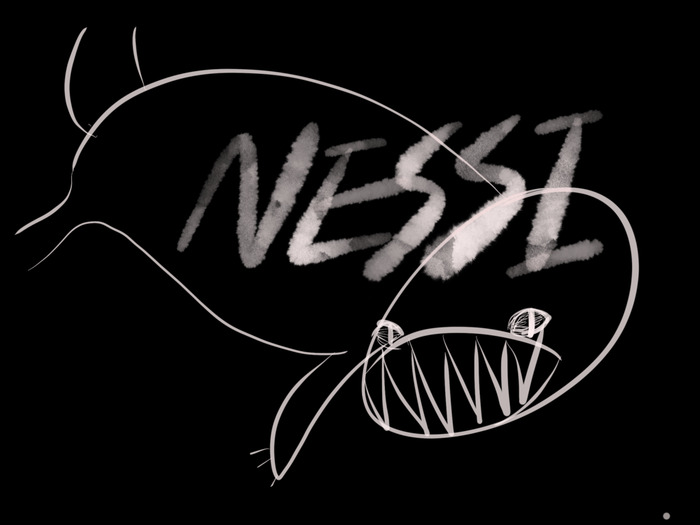

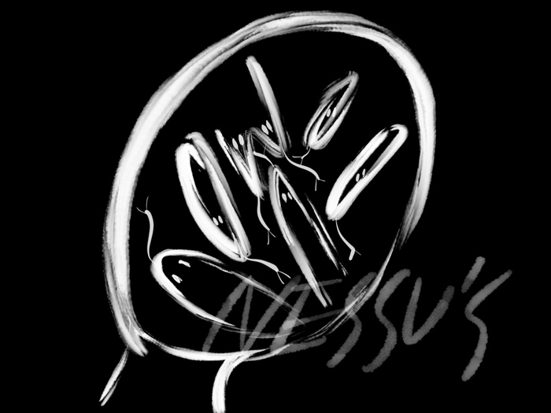

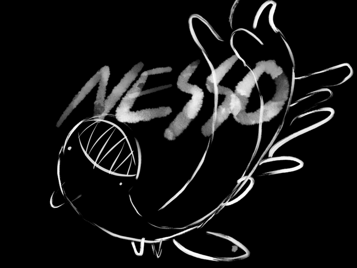

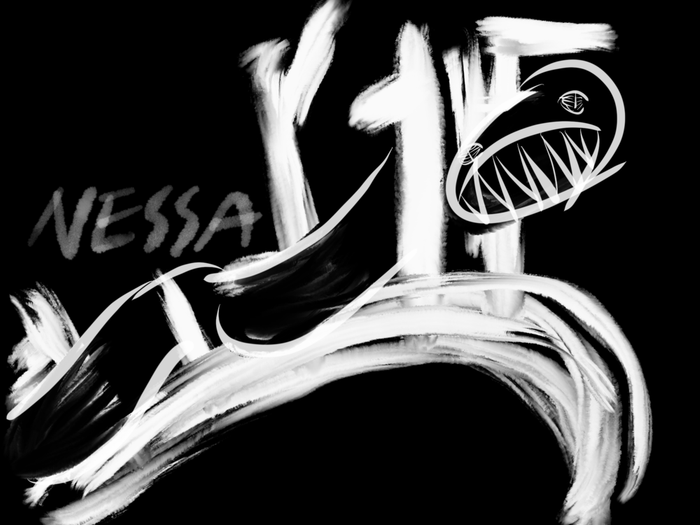

  
1\. New creatures  

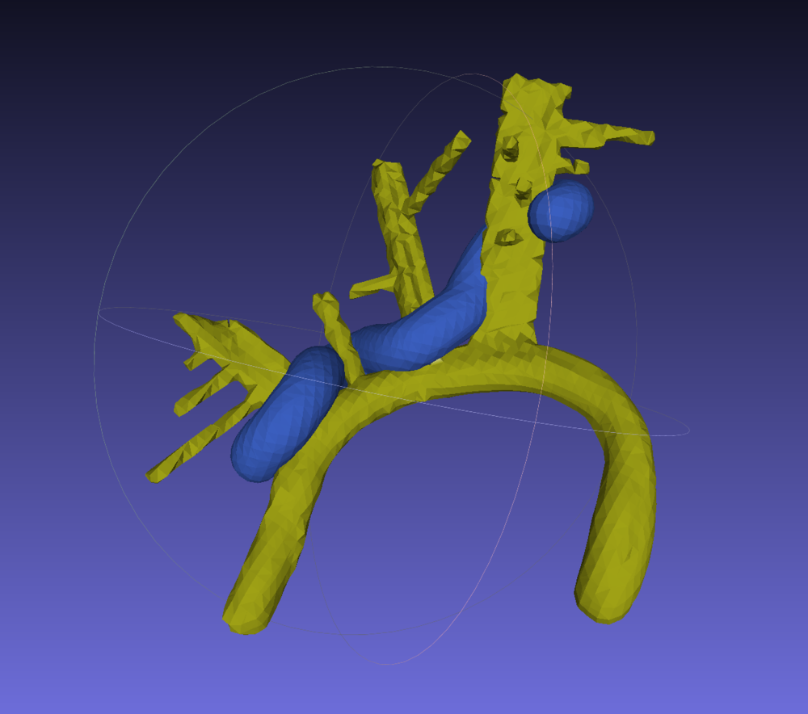

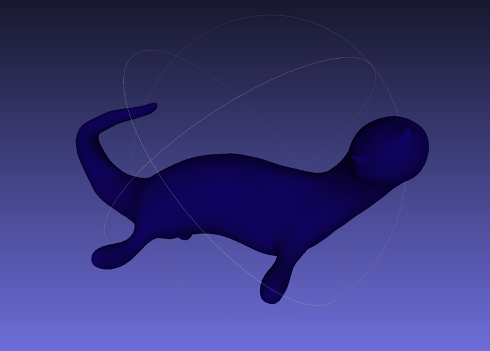

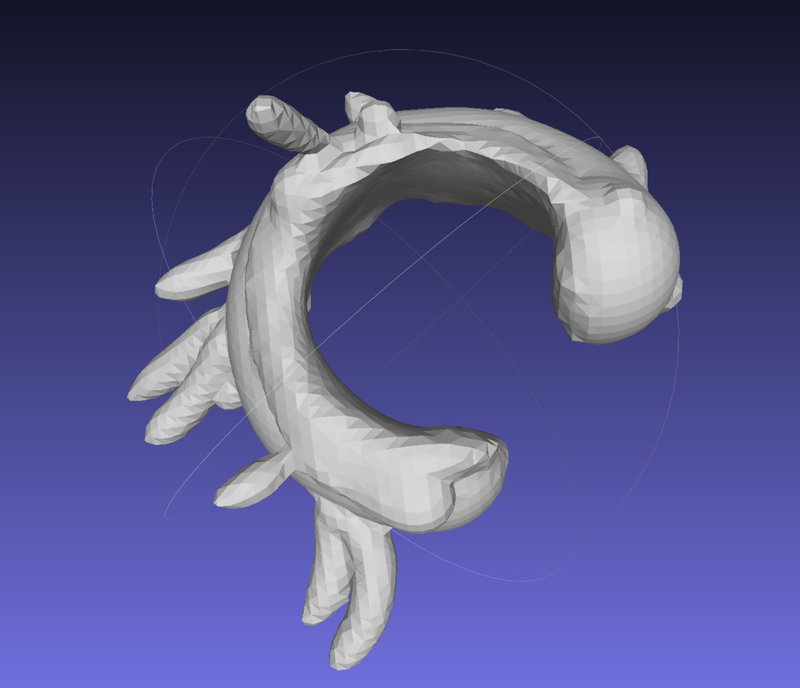

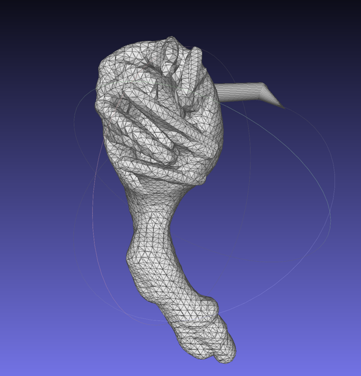

  
Made 3 more shapes in Oculus Medium, tried to make more general fitting
earrings that everyone can wear. Inspired by ear hugger, ear jacket shapes.
and put pin to a piercing so person just can wear like piercings. Printing pin
with a toy didn’t go well since it was too fragile, I broke all of them while
sanding. I switched to drill a hole and put a brass tube into the hole.  

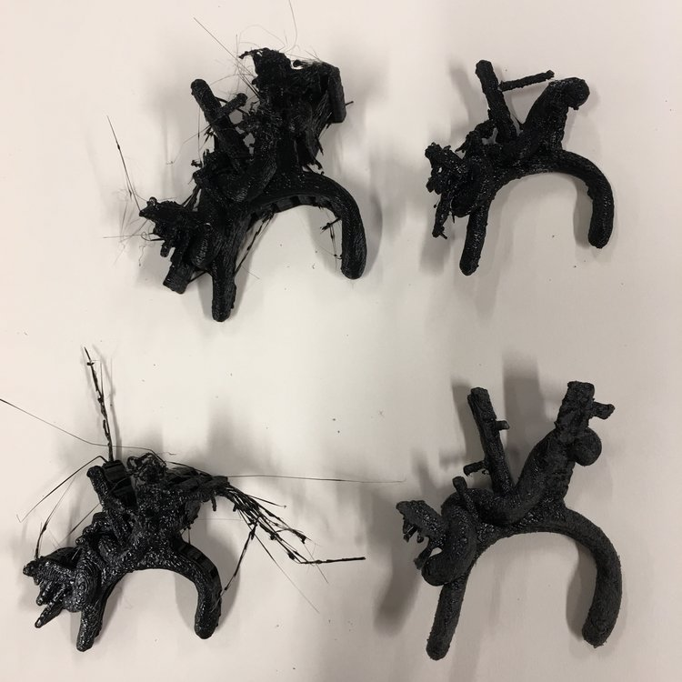

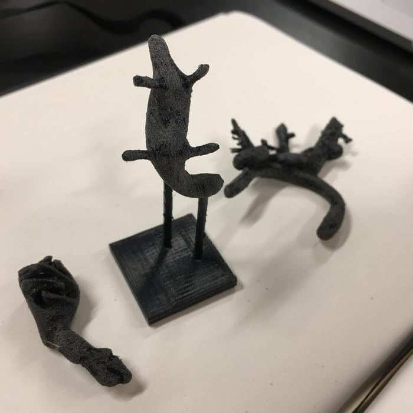

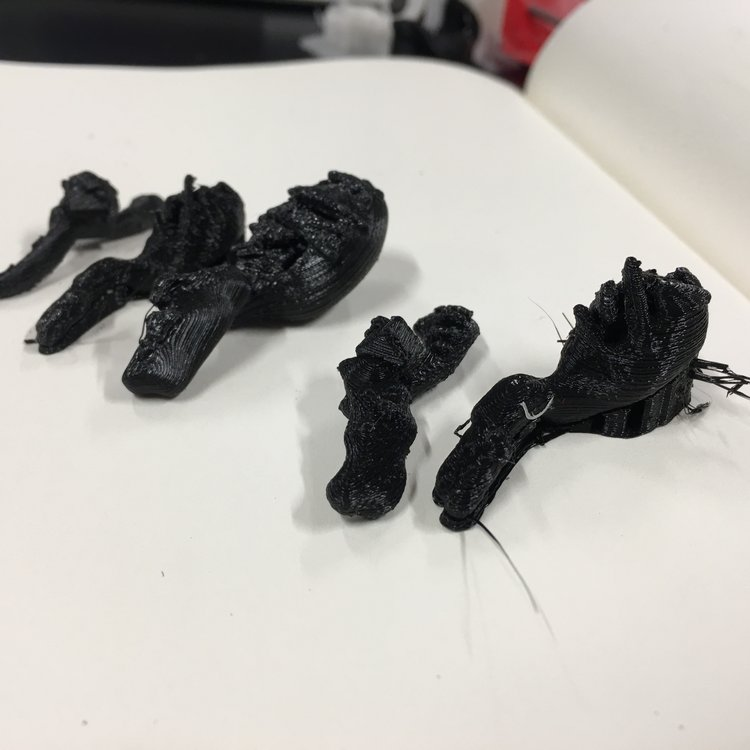

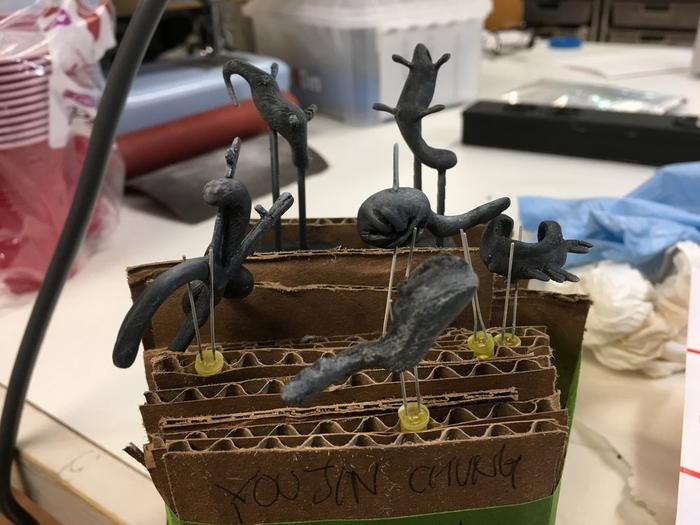

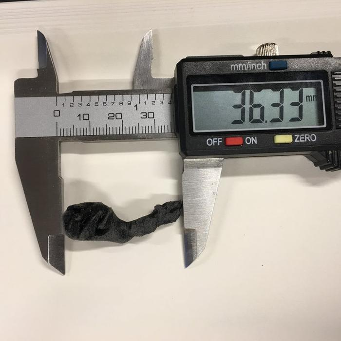

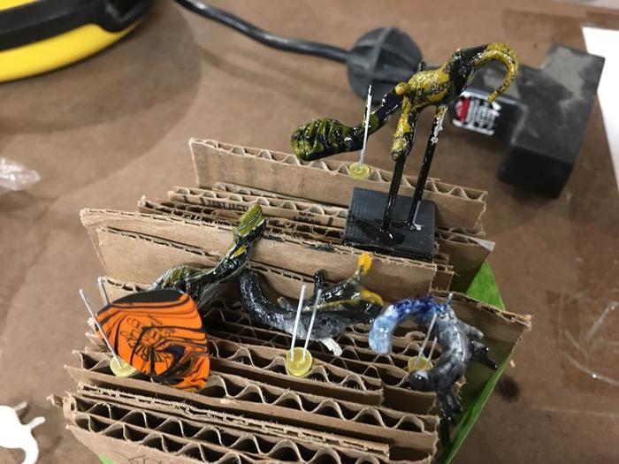

  
Printed them, sanded them, and put transparent plastic primer for coloring. I
tested water marbling, but the paints are also translucent, turned out too
dark.  

  
So, sprayed white primer 2-3 times, sanded the surface, water marbled again.
The coloring was pretty satisfying / okay to me, but I didn’t have time to put
vanish on them. I heard the coloring was too dirty during the critique and be
recommended to use solid color so people can focus on the shape, rather than
the color. I guess I can try to polish them after coloring, it might make
people feel better than this sticky feeling, also I definitely try solid
colorings. (If I have more time in the future.) Also, the ear film was moving
inside of the package, I might try to use vacuum foam of the silicone ear and
put them in the box to make it more stable. (Ben + Pedro feedbacks)  
  

  

  
  
October 20, 2018  
  

* * *

# Package Design

  
0\. Amber making - continued from last week  
  

  
Last week I ended up with putting resin in a cup with two Nesi’s. They are
totally cured, so I cut them with bandsaw, and sanded. (KA161 ->60 A/0
something ->P320 PB1) As we watched last time, I water sanded with the last
sand paper. I still need to wax polish them. Anyway, I feels so satisfying
like touching a pebble.  

  1. New sketches (including packaging idea)

  
I struggled a lot with Nesi’s curve and scaling, so I changed the approach to
benchmark the structure of ear piercings. There are a lot of attractive
jewelry structure while keeping a simple structure and one size for everyone.
Since I already have Nesi, I will choose three of them.  

  
For package design, I was inspired by vacuum tubes. I ordered plastic tube and
caps from Uline (I don’t need 25 sets of them though…). What I need to do is
laser cut cardboards to ear shape and pin my jewelry toy on the cardboard, and
hang them tight in the cylinder. So I can display them in the package and give
audience a sense of how to wear them. I wish I can draw some art-toy like
label.  

  
cut the rods from Nesi.  

* * *

# Finish

I learned a lot this week, means epic failed again and again.  
  
Since Saturday I 3d printed lots of time, and even silicone molded with the
model.  

  * The size: 32-35mm is fitting for general ear sizes. But I cannot sell these as earrings online since all ears are so different, unless I find a magical way to measure people’s ear remotely. When I use Cura, it was around 35% scale of the original 3d object file.

  
Watch tutorial before use the material..!!!! I didn’t and learned by
experience, which was totally preventable. I used Smooth on Dragon Skin and
Crystal Clear 202 and they have terrific video tutorial for “Resin mold for 3d
printed model”….Anyways, what I learned were  

  * I need TWO tunnel for resin mold if I want to pour resin through the silicone cast. That was the main reason I 3d printed the model again.
  * It’s hard to glue rod on PLA printed model… It’s much better to print all of them from beginning.

  
I sanded with 0. coarse sand paper 1. nail filer 2. fine sandpaper and the
last one felt like stone. It was so good but I kept breaking legs for each
model. It was frustrating and consuming a lot of time, and I noticed,  

  * Who decided Nesi has four legs? It is so boring having four legs. It could be odd number, too many or even none! legs are not even supposed to seem like regular legs.
  * Having these tiny legs is definitely wrong design for 3d prototyping.

  
I decided go with 2 legs left after sanding.  

  
Nesi with 2 legs looked awesome, it seems a bit of a plant and an animal at
the same time.  

  
I went through silicone casting and resin mold with a new model and found I am
wasting material compare to the size of my model..I need to find a way to save
them. I just put a blue color for the first trial, but I will try color mix if
the resin mold success. With the resin leftover, I made preserved Nesi’s.
(Hopefully they could look like amber fossils.)  

* * *

# MATERIAL AND TECHNIQUE SCULPT

This week I just went through the whole process to the finish of my sculpture.  
  
Bottom line first, I decided to use resin mold for rest of this semester.
Considering the shape of my toy, I cannot use CNC unless break down the
sculpture.  
If I stick with 3D printing, there are 3 ways to do that:  
-PLA(most common) print and do after works.  
-Resin printing  
-PLA prototype and resin molding  
  
The merits of resin mold are coloring and preciseness. I tried to color and
polish the 3D model this week, and it just revealed how bad I am with
painting, also even sanding. If I want to color the PLA printed model, I’d
better use spray brushes. but I still need to make maskings for color blocks.  
  
Resin mold is a traditional technique for high-end jewelries and fountain
pens, which makes my toy more persuasive as a product.  

  
  
  
I got some inspiration meanwhile  

  * sneakers color blocking - I was thinking art/designer toys are alike sneakers somehow. Since the streetwear culture is what I am familiar with than art toy, I wanted to co-op them.
  * 

  

  * glossy finish - the candy-like, glossy and smooth finish caught me. Especially ceramic glaze finish looked so cool to me.

  * wearable - my toys will be wearable anyway, I need to exchange some part of toy with metal. Many earrings such as ear hoop, ear climbers, ear jackets are actually bendable so customers can adjust jewelry to their body. I think I can print bass part when I decide the final 3d model.

  
The plan for the final 4 pieces are like this.  

  1. The original color-blocking ear bug.
  2. one with fur on the belly.
  3. one with audio filter by DIY PCB. Neuromancer inspired.
  4. chimera version with bone / insect crust.

  
For actual scaling, I made a clay version of the creature and measured it. It
was 37.53mm from end to end, I can scale 3d model again for prototype.  

  
I sanded it and sprayed the primer. I broke a leg and the tail tip while
sanding. Maybe I can try tumbler in stead of sanding. I heard I can wipe with
alcohol if I want to color 3d printed models. (Before using primer I guess) I
can try next time.  

  
I marked borderline with sharpie. I expected the facial expression remains,
but the sharpie blurred and disappeared when I painted only one time. A very
basic tip - paint with bright color first..  

  
Anyways, finished with glossy vanish and waiting to dry.. One thing to think
about is, how to express color block while using resin mold.  

* * *

# SCULPT YOUR TOY

My goal of this class is making wearable art toys, especially on ears.  
  
Bought some silicon ear model from Amazon. It’s hard to borrow someone’s ear
all the time, these are for hands on fabrication and scaling.  
  
I bought some clay and wires for sculpting anyway, I tried Oculus Medium and
it was much intuitive and easy than I expect. I just finished my first piece.  
  
I used an ear stamp as base, and put continuous clay over it. Since I used 2
separate layers, there’s no issue for extraction or so on. After putting
clays, I turned off the layer of the ear stamp so the size and coordinate is
off. Mostly I used smoothing tool, cuz swirl made clay twist in clockwise.  
  
I was inspired Nesi laying on back on the surface of the ear. Wanted to put
furry fair on the belly later. I can still try when I find the right scale.  
  
All the earring series will be inspired on fears regarding ears, such as
water, ear bugs, optic nerve coming from earring holes…(totally urban legend)  
  
Medium was super intuitive though, the big pitfall is hard to scale to real
size. 3D modeling tools provide measures thought, it won’t be accurate till I
make a real size prototype and measure equivalent points.  

  
Apparently too small for ears, but I guess you can get the sense what I
intended.  
I scaled up the model with meshlab. (it’s the most reachable tool for me) I
scaled twice for each axis, meaning 8 times inflated than the original. (and I
was a mistake. should done root 2 times scaling.) but the good part was I
figured out that VR modeling is too low poly and I could to Laplacian
smoothing with MeshLab.  
  
I even put eyeballs on it, but it was not distinguishable for its size. I
scaled it up 8 times bigger and printed again. The thing is I need to make a
file using Ultimaker Cura or Cura Lulzbot edition and it was such pain in the
ass. Both didn’t running well on MacOS.  

  
The second one was too big. I can still go for the finishing, such as using
spray brush or resin coating, and putting hair on the belly! I also learned
removing supports is hard in the case of organic shape. I need swirl for this.  

* * *

# BLANK MODIFICATION

  
We’ve got 3 wooden pegs to modify.  
  
Searched junk shelf, and got some junk pieces and inspiration.  
putting a wheel.  
I found a wheel for chair. I put a hole on the bottom of the peg to hammer the
wheel inside.

  
It seemed a bit simple, so I made a hat for it.  
  

  

  * Switch a head with an eyeball  
  
Interestingly, Phil found an eyeball on the floor that looks like one in my
character drawing. Inspired by Sauron, I made a… Sauron peg.

  
Simply I cut the head of the peg with a bandsaw, and put a plastic eyeball
with glue.  
  
I had mylar sheet in my bin, made a cloak for it.  

  

  * Cut in a half

  
I make a hole and cut a head, why not cutting in half?  
  
So just did it. Originally wanted to draw intestines on the surface but was
recommended dig the flat surface and put some thread or yarn to add texture to
the peg. (Also it is easier than drawing.)  
  
I tried to dig the surface. I didn’t have gravers but we had drop-drill(don’t
remember the name). I needed to tie the halves with a rubber band and make a
hole between them. I should have drilled a hole first and cut in half later.  
  
I had a acrylic mirror sheet. My plan was to let people see the intestines
through the mirror. I measured the size of the peg, and cut the acrylic with
bandsaw, and sanded to curves.  

  
Lastly, found yarns and wires and glues in the gut of the peg. I finished the
toy by putting mirrors and the peg on the piece of wood.  
  

  
  

* * *

# Character Turnarounds

  

On the first day, we did intense character drawing. I chose tooth + slime
theme, and got couple of drafts.  
  
Based on them, I come up with a wisdom teeth character and drew a turnaround
of it.