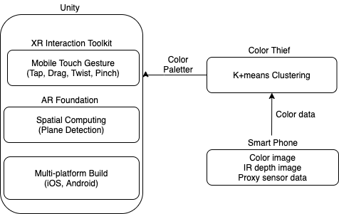
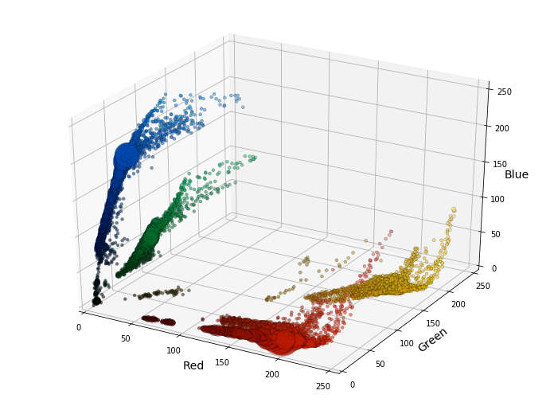
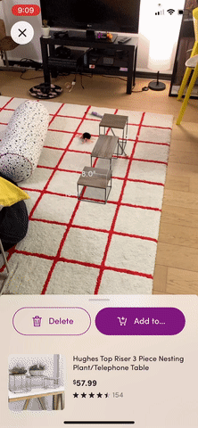
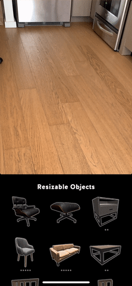
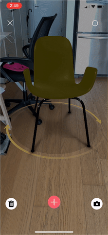
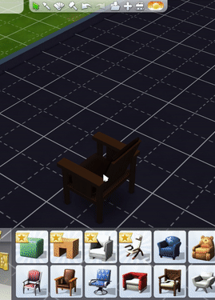
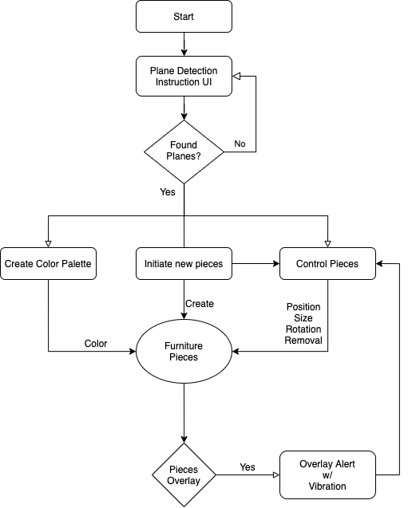

# ColorPiece

[Instruction](#instruction) | [How it works](#how-it-works) | [Design Process](#design-process) | [Credit](#credit)

"What if you find a piece of furniture but don't know what color to choose?
ColorPiece can help you to find the perfect color that suits your environment!"

<iframe src="https://player.vimeo.com/video/535701015" allowfullscreen></iframe>

## Instruction

**Plane Detection**

When the app starts, you will see a coaching guide to detecting planes.
Scan the floor that you want to place on the piece.
Once a plane is detected, the guide will be gone.

**Place & Select a Piece**

Place any piece by tapping the floor.
You can select a piece by tapping it as well.
If you want to remove it, Press the 'X' button on the top right while the piece is selected.

**Move, Rotate & Scale a Piece**

Please select a piece to control.

Move:
- Put the finger on the piece and drag it to the position to place.

Rotate:
- Put a finger outside of the piece while it is selected, and drag the finger.
- Or put two fingers on the piece and twist the fingers while keeping the same distance.

Scale:
- Put two fingers on the piece and make them closer to scale down, and make them further to scale up.

**Overlapping Alert**

ColorPiece will give you alert and vibration when pieces are overlapped.
If you see the alert, please move one of the overlapped pieces for proper positioning.

**Color a Piece**

You can generate a color palette no matter if there is a piece on the scene or not.
Press the color palette button in your favorite scene to generate a color palette.
Please select a piece first and click on the color to change the color.

## How it works

ColorPiece = [Unity AR Foundation](https://docs.unity3d.com/Packages/com.unity.xr.arfoundation@4.1/manual/) + [XR Interaction Toolkit](https://docs.unity3d.com/Packages/com.unity.xr.interaction.toolkit@0.9/manual/index.html) + [Color Thief](https://lokeshdhakar.com/projects/color-thief/)

ColorPiece is working based on Unity AR Foundation and Color Thief for Unity.

(Please note that the diagram is conceptual, not precisely correct in the sense of hierarchy.)

**Unity AR Foundation, XR Interaction Toolkit**

Unity provides a strong base for AR development. With Unity AR Foundation, I could easily set AR environment for the given scenario. It includes placing objects according to the environment and get the physical computation of objects in the scene (to calculate collision).

XR Interaction Toolkit provides various mobile input gestures, one-finger, two-finger tapping, twisting, pinching. Utilizing these gestures can save the space for AR experience, especially for the experience that requires most parts of the screen not covered by UI.

On top of that, the most fundamental reason to choose Unity is multi-platform build. When we assume having a camera is necessary to know what users have in the room, we can move on to experience working on a smartphone. Prototyping with Unity is efficient since we can deploy to both iOS and Android with one project development.

**Color Thief**

Color Thief clusters color in the scene, and we can extract the representative colors of each cluster.
We can assume that those representatives are the recommendable colors for your new piece of furniture, or we can link them to popular color schemes for interior design.

## Design Process

**Visual Format Decision - 3D model**

To decide a proper visual format for product X can be a good start. Finding the right representation can:
- provide better experience/info for users about product X.
- make it easier to decide a suitable platform to develop.

I can start with given examples: image, 3D model, videos, light fields.
- move, add, remove pieces of product X: medium has to be interactable.
- show rotated representation of product X: medium has to be 3D.
- convey furniture's properties properly: furniture itself is 3D (for most cases).

**Platform Decision - AR and Unity**

Now we know we will work with a 3D model. Then the platform can be anything that handles 3D objects; 3D games, web app, VR, AR, Light Fields, etc.
I chose AR because we want to include their space in our experience for the user wants to look for furniture for their space.

To develop AR experience, I chose Unity for the reasons above(at how it works). It supports many tools for AR development and allows efficient distribution for various OS. Also, app performs better than WebAR.

**Research on Related Experience - Multi-touch Gesture Input**

I tested many space design apps: Wayfair, IKEA, Interior Defind, Housecraft, The Sims.

I learned:
- There are common interaction gestures to control the object: one finder to move and two fingers to rotate.
- They are not putting many UIs on the screen.
- If they are not using multi-touch gestures, the scene needs complex UIs.

I chose to use multi-touch gesture to make the UI simpler.
User needs space to move around the product X, and I could say that there is common understanding about multi-touch inputs.

**User Research**

I've asked my friends about pain points when purchasing furniture, and the answers were:
- precise sizing
- color matching
- material matching
- interior style matching
- price

**Research on Paper, Articles and Statistics**

*12 FURNITURE STATISTICS EVERYONE SHOULD KNOW, Civil Space*

- From 2014 to 2019, the furniture industry grew by 2.2%. (Source: IBISWorld)
As a result of necessity and a desire to customize their home through the color and design of the selected furniture, furniture sales have continued to increase. The industry continues to grow in line with consumer demand.
- 31% of consumers will pay more than their budgeted amount if they find the perfect item. (Source: Small Business Trends)
All it takes is the perfect item in the right size, shapes, design, and color to change their minds about a budget.
- 84% of people prefer to buy their furniture new. (Source: FurnitureToday)
The reason could be due to the longer life for new furniture or a desire to decorate a space with a specific color scheme in place.

*8 Things You're Doing Wrong When You Buy Furniture Online, Jennifer Geddes, Jul 26, 2018*

Eyeballing the color - Chances are good you've been the recipient of a shirt or a pair of shoes that looks nothing like the color you picked online, in part because computer and phone screens display color differently. But when it's furniture? That can be an expensive mistake.
Still can't decide whether the color will work in your room? Head to Instagram or Pinterest for amateur photos that will give you a better idea of how the piece appears in real life. Or take advantage of technology—both Wayfair and Chairish offer a "view in room" feature so you can see how a piece will look.

*Decorating 101: How To Choose Your Colors, Houzz, Forbes, Sep 23, 2014*

Consider your location and the amount of light you have as well. Bright, hot colors work well in warm, sunny climes, where the sun diminishes their intensity. But they may not look as good in grayer northern climes. Sometimes the best colors can be found right outside your door — in the vegetation and rocks in your landscape.
Another approach to choosing color is to take the hue from an object you already own — ideally, an investment piece like a work of art or a rug. If you love the item, then you will usually love the same colors reflected elsewhere in the room.

*Consumer Attitudes and Buying Behavior for Home Furniture, Nicole Ponder, 2013*

Social media also play a role in searching for information about furniture. This is especially true for Generation Y.
Popular sites include Tumblr, Twitter, Pinterest, LinkedIn and Facebook (Notess 2012).

**Killer Feature - Color Palette**

From the research above, I got an idea about the color palette.
- Color takes a significant role in furniture purchase.
- Millennials rely on social media images. Popular images on Pinterest, Instagram, and Tumblr attract their followers with visual aesthetics. The matching color of the objects is one of the components.
- Professional interior designers recommend finding the color palette from the environment.
- Precise measuring can be supported by LiDar sensor with upcoming smartphones.
- Similar style recommendation system works good enough. (It is my personal opinion).

When I googled about the color palette, I could find [this blog](https://towardsdatascience.com/algorithmic-color-palettes-a110d6448b5d) using K-means clustering and Agglomerative clustering to generate a color palette from a 2D image. I couldn't implement this blog's python code to unity, but I found Color Thief for Unity instead.

**UX Flow**

**Further Ideas**

- Generative Texture: As we recommend color in this project, we can work on texture as well. [Deep Textures](https://www.cunicode.com/works/deep-textures) as reference
- Haptic Experience: Users want to feel the texture of the product
- Share the User Interior design: AR world to invite friends to their room and design collaboratively (Unity provides ARCollaborationData example for this.), or social media like Pinterest, Instagram
- Plane Classification: AR can classify doors, walls, and floor. We can recommend items accordingly.

## Credit

Icon images by Flatart from the Noun Project

Sofa by iconcheese from the Noun Project

Brush by Nidhi Vaghasiya from the Noun Project

Floor by worker from the Noun Project

Music by Benjamin Tissot from Bensound
