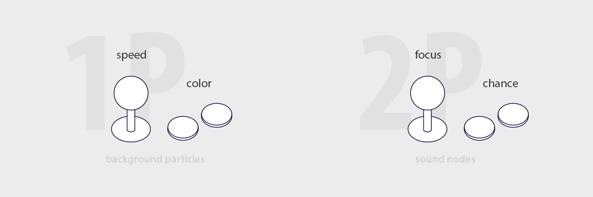
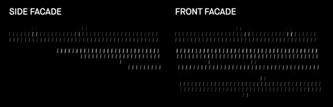
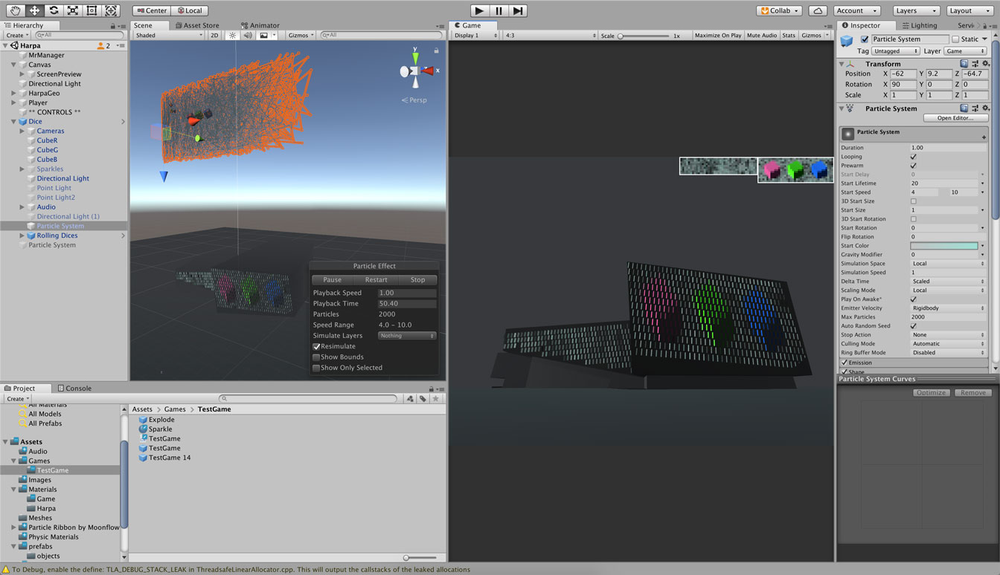
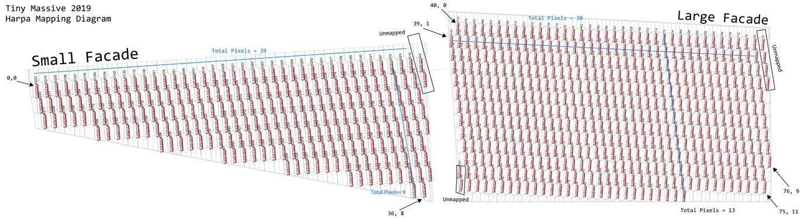

_**[Github Repo](https://github.com/youjinChung/DICE)**_  
Featured at Reykjavik Winter Festival 2019

<iframe src="https://player.vimeo.com/video/318835829" allowfullscreen></iframe>

  

    
    
    
    
    
    
    
  

  <button class="carousel-btn prev" onclick="moveDiceCarousel(-1)">&lt;</button>
  <button class="carousel-btn next" onclick="moveDiceCarousel(1)">&gt;</button>
  

Dice is an interactive light/music installation, which is award-winning work at Tiny Massive, Reykjavìk, Iceland. 
The project was shown during Reykjavìk Winter Festival, 2019. 
The audience and enjoy visual and audio interaction with the mapped game on Harpa. 

## System

[Playable Online Demo](https://youjin-c.github.io/DICEdemo/index.html)

The DICE music system is using [Markov
Chain](https://en.wikipedia.org/wiki/Markov_chain). On top of the base drum
line, the player can adjust probabilities of the main sample audios.

Magenta - 0% 
Green - 50% 
Blue - 100% 

For each loop, DICE have randomly generated probability, and it determines whether each sample will be played or not. 
The player2 can change the probability of each die, and the music will be played on the next loop. The player1 can change the color of the background particle and the speed of it. 
We used Unity3D to express 3D texture on the 2D LED surface on Harpa. 
The 3D visual is appreciated as a new approach to Harpa surface. 

<iframe src="https://player.vimeo.com/video/318837289" allowfullscreen></iframe>

## Role

Unity 3D programming: Audio System, Markov Chain System on Cubes, Visual Effect

## Credit

[Dongphil Yoo](http://dongphilyoo.com/): Art Direct, Visual Allignment in Unity 3D, Documentation  
[Joohyun Park](https://www.parkjoohyun.com/): Concept, Music