# Dead Wood  

  

_**[Github Repo](https://github.com/youjinChung/DeadWood)  
**_
_**[Paper](https://docs.google.com/document/d/e/2PACX-1vQOm5emDvuGNVrj26LrcXf8KmtOVZYLAbMtxnwIKdyYtV15GzW_Qawxv8D3-Re4gUQPfal7ShGyn82G/pub)**_  

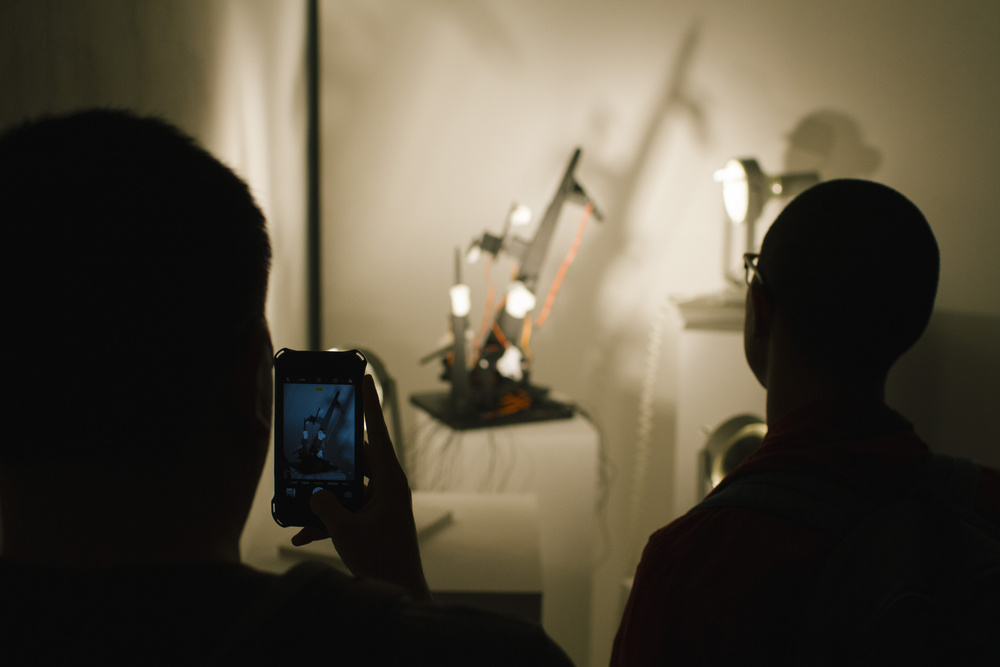

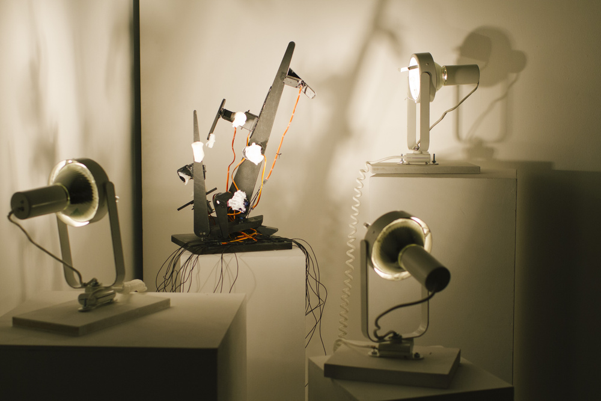

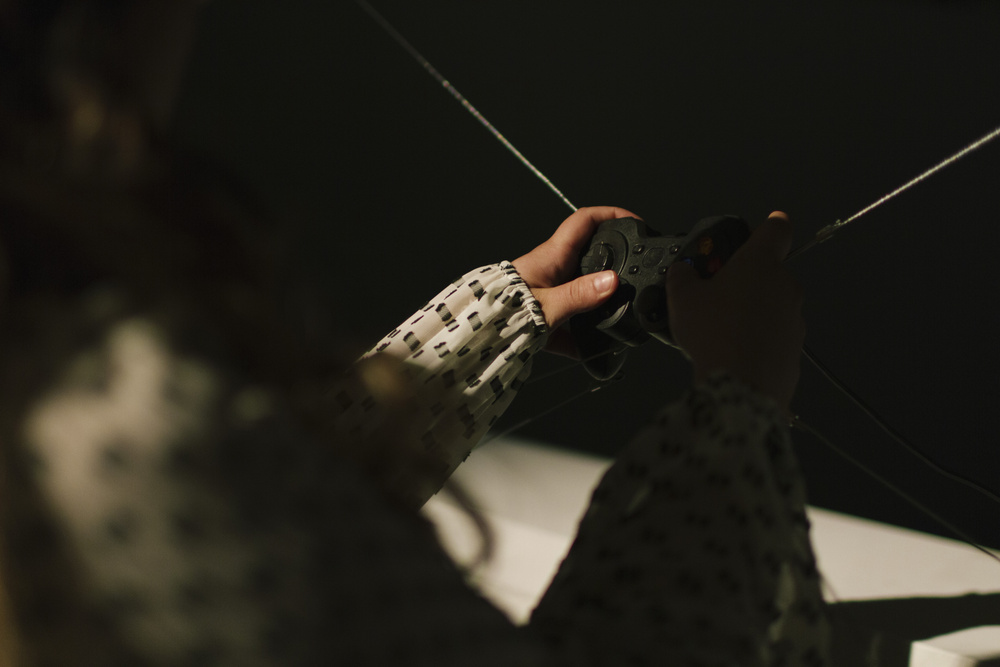

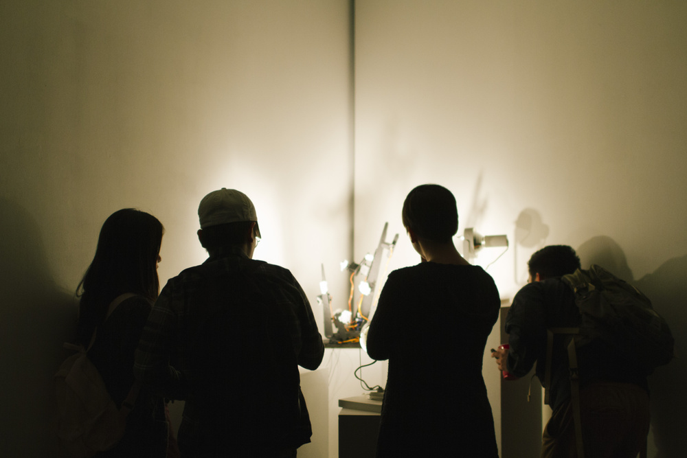

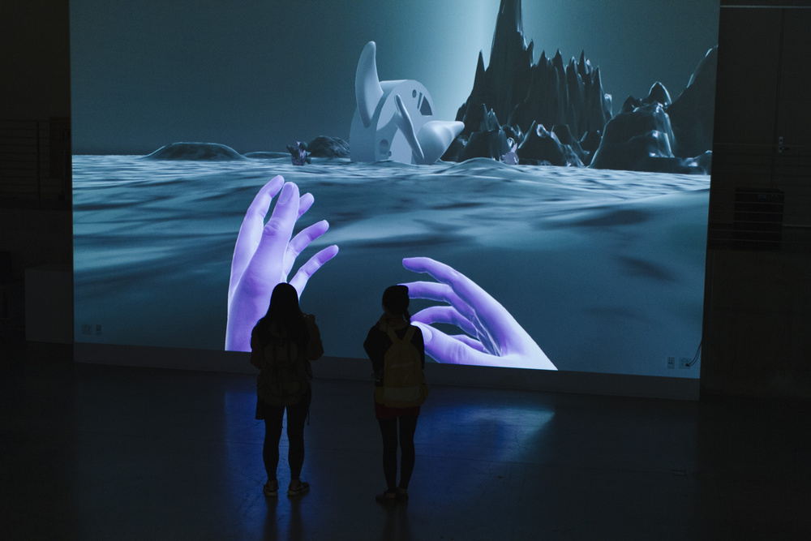

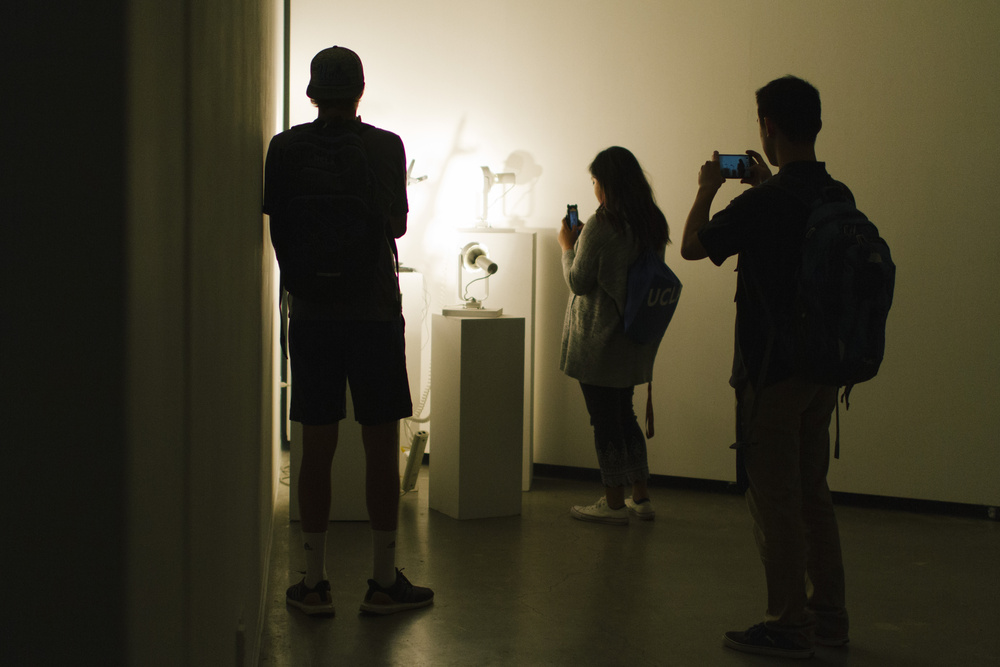

This project is inspired by the murder of hitchBOT in Philadelphia. From the
articles that state this accident as a murder, not vandalism, Dead Wood
questions empathy and anthropomorphism. In the era of AI, both threat and
understanding towards different entities are anthropomorphized. Humanity, as
potential and current cyborgs, Dead Wood advocates the expansion of empathy.
The empathy towards non-human, robotic, or artificial beings will mirror the
empathy towards humanity.  
  

  

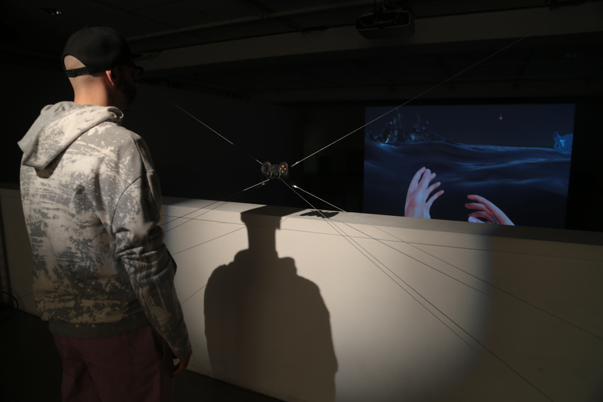

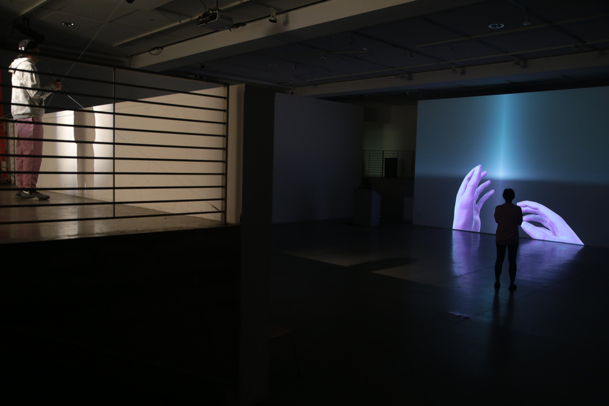

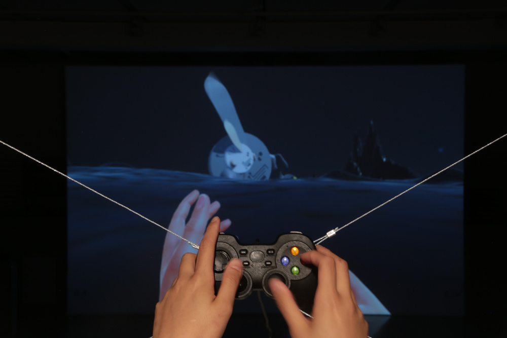

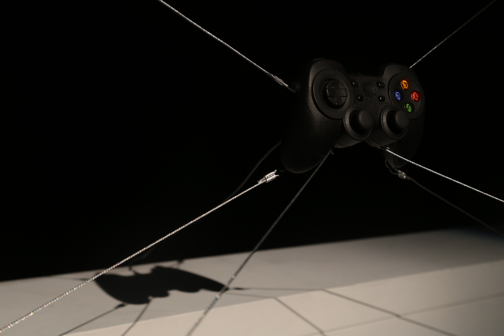

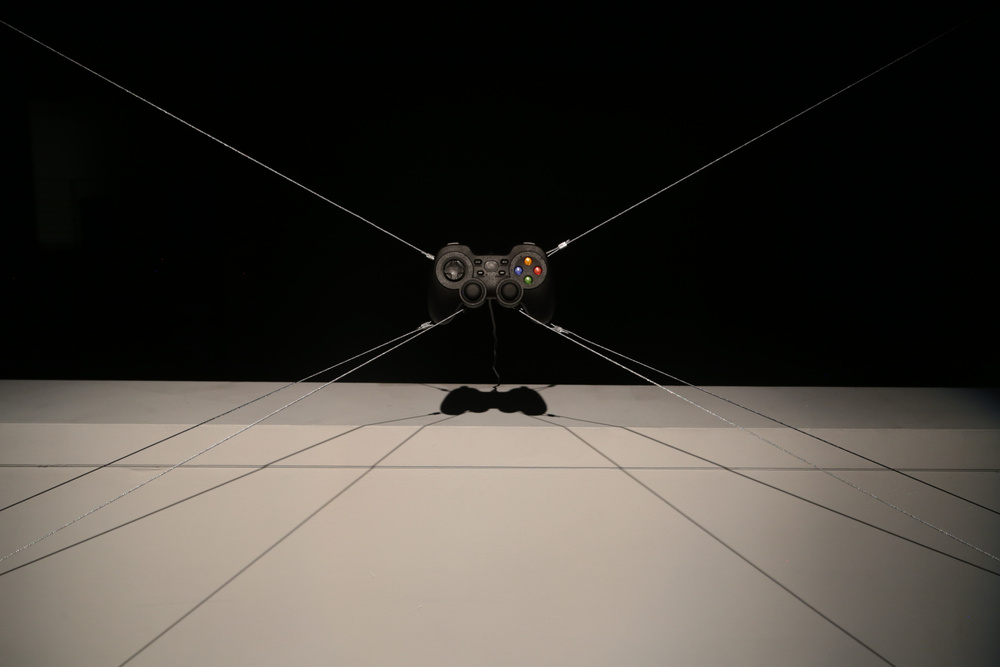

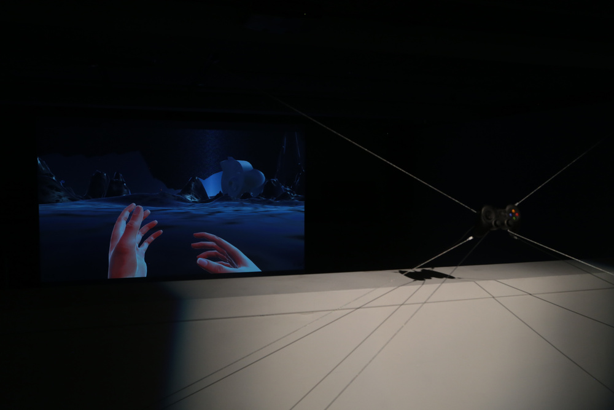

The show has two pieces. An interactive video game with an installed
controller and a kinetic sculpture. In the game, the audience can see the
“hands”, representing humanity and chimera entities on the field. What the
audience can do is destroy them and see the pixelized particles of the
objects. More the player kills objects, more the world is glitched, and they
will see Laozi’s quote: “The usefulness of a pot comes from its emptiness.”  
  

  

The kinetic installation is a servo-powered tree shape sculpture with 3D
printed chimeras from the game piece. With the quote of the game, it
represents the arbitrariness of anthropomorphism.  
  
  

## System  

Unity3D + Xbox controller as input  
Arduino, Motorshield and Servos + 3D printed sculptures  
  

## Role  

Concept, Programming, Art, Installation  
  

## Credit

[Sanglim Han](http://sanglimhan.work/): 3D modeling  
Ji Yun Hwang: Music  

Featured at DMA Solo Show  
April 11-13, 2017