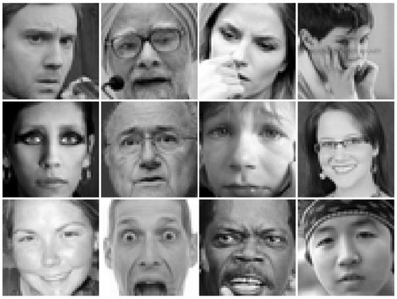
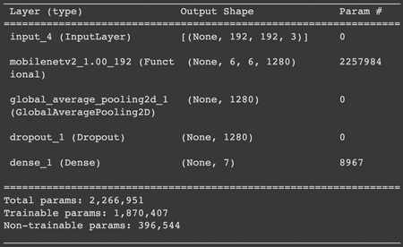

# Emotion Detection: Multi-class classification and Quantization

  

This is a multi-class classification model for Snapchat Filter. It has around
0.75 accuracy and is relatively small, 2.7 MB, designed to run on mobile
devices in real time.  
It is possible to get higher accuray models with bigger size. This project
focused on get the smallest size(<10MB) and keep the accuray.  
  

# Dataset  

FER2013 is a dataset for Facial Expression Recognition, released by Goodfellow
in 2013.  
The data consists of 48x48 pixel grayscale images of faces. The faces have
been automatically registered so that the face is more or less centred and
occupies about the same amount of space in each image.  
  
The task is to categorize each face based on the emotion shown in the facial
expression into one of seven categories (0=Angry, 1=Disgust, 2=Fear, 3=Happy,
4=Sad, 5=Surprise, 6=Neutral). The training set consists of 28,709 examples
and the public test set consists of 3,589 examples.

  

# Model

Used Keras MobileNetV2 backbone and transfer-learned on ImageNet  

  

# Data Augmentation: EDSR  

Initial 48x48 dataset showed low accuracy (~0.6) so I upscaled and refined
FER2013 dataset.  

## Refinement

The dataset had error images such as loading error image of the image url, or
simple line drawings instead of phothos. Some had wrong category labels as
well. After removing error data and move some of them to right category,  

## EDSR

EDSR stnads for Enhanced Deep Residual Networks for Single Image Super-
Resolution. It upscales images with great quality. I upscaled 48X48 pixel
images to 192x192 pixels, without losing not many information. This is 16
times of upscaling.  

  

After data augmentationa and preprocessing, accuracy raised upto 0.8 with
training sets.  
  

# Quantization  

Quantization for deep learning is the process of approximating a floating
point (normaly 32bits) neural network with lower bit values (16bits or 8bits).
This drastically reduces both the memory requirement and computational cost of
the network.  

  1. Post-training quantization  
Post Training quantization requires a representative dataset to estimate the
range, i.e, (min, max) of all floating-point tensors in the model so that we
can establish a better mapping from floating point to integer space.

  

  2. Quantization aware training  
Quantization aware training simulates the lower precision behavior in the
forward pass of the training process. This introduces the quantization errors
as part of the training loss, which the optimizer tries to minimize during the
training. Thus, QAT helps in modeling the quantization errors during training
and mitigates its effect on the accuracy of the model at deployment.

  

8.5MB Original  
2.6MB Post-training quantization  
2.7MB Quantization aware training  
  

# Optimization  

## Facial Landmarks

  
  

When we only train with cropped face images, we can expect some classification
challenges; they all look similar in terms of human faces. It would be easier
to classify according to sex and age, but facial expressions are subtle.  
Facial landmarks are coordinates of eyes, eyebrows, nose, mouth, and contour.
Especially positions of eyes, eyebrows, and mouth show notable changes
compared to image pixels of photos.  
We can add these facial landmark coordinates as concatenated input to the
image pixel information. There are several papers showing enhanced
performance.

  

## MobileNetV3  

  

MobileNetV3 shows better accuracy and running time. We can use it as backbone
for custom data training.  
  

## CK+ (Extended Cohn-Kanade dataset)

The Extended Cohn-Kanade (CK+) dataset contains 593 video sequences from a
total of 123 different subjects, ranging from 18 to 50 years of age with a
variety of genders and heritage. Each video shows a facial shift from the
neutral expression to a targeted peak expression, recorded at 30 frames per
second (FPS) with a resolution of either 640x490 or 640x480 pixels. Out of
these videos, 327 are labelled with one of seven expression classes: anger,
contempt, disgust, fear, happiness, sadness, and surprise. The CK+ database is
widely regarded as the most extensively used laboratory-controlled facial
expression classification database available, and is used in the majority of
facial expression classification methods.  
  
  

# References

[snapml-templates  
](https://github.com/Snapchat/snapml-
templates/tree/main/Quantization%20With%20TFLite)[FER-2013](https://www.kaggle.com/datasets/msambare/fer2013)  
[EDSR in Tensorflow](https://github.com/Saafke/EDSR_Tensorflow#edsr-in-
tensorflow)  
[Emotion detection using facial landmarks and deep
learning](https://medium.com/@rishiswethan.c.r/emotion-detection-using-facial-
landmarks-and-deep-learning-b7f54fe551bf)  

Jan 2023