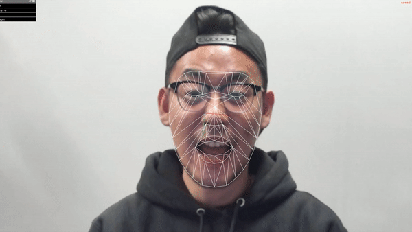
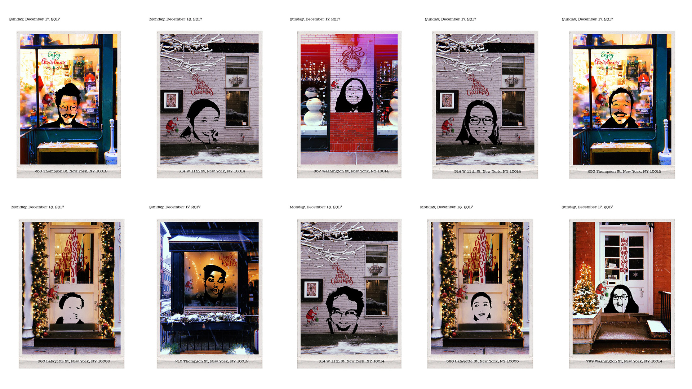
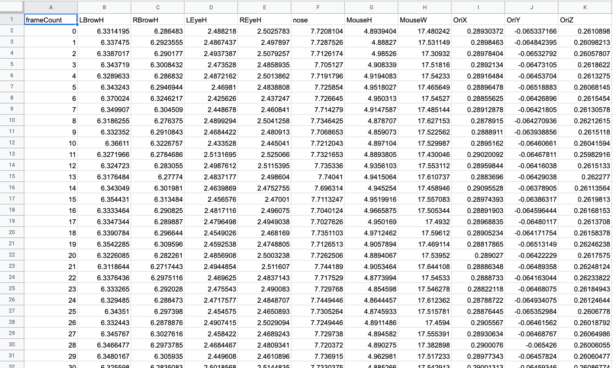
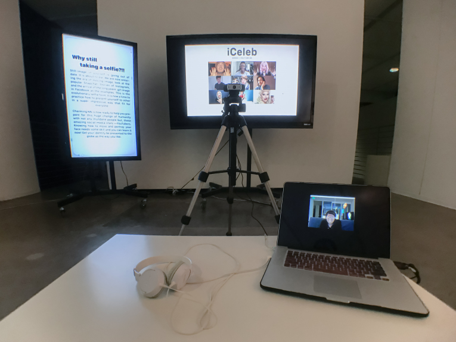
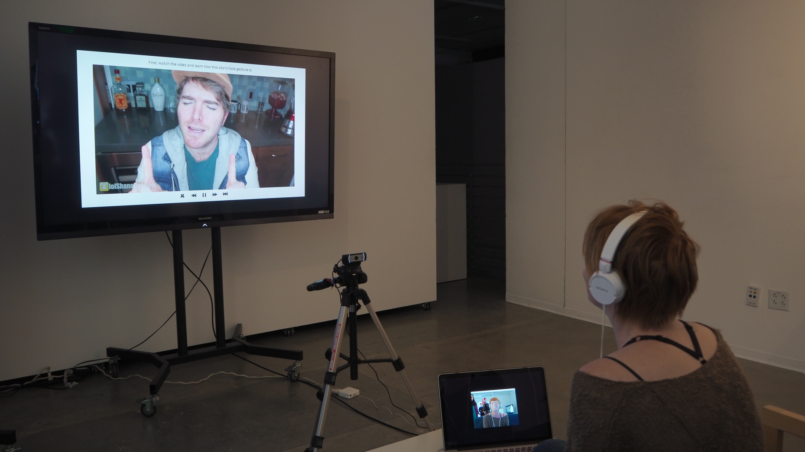
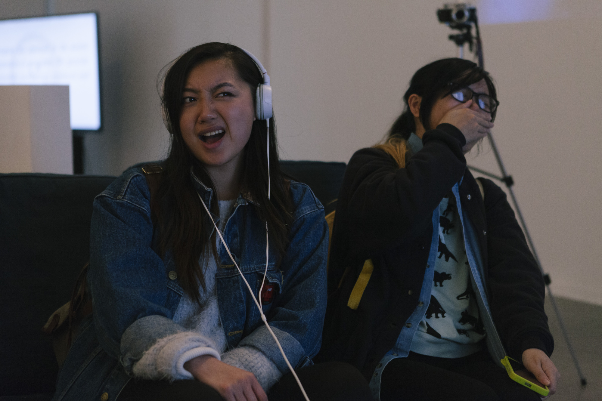
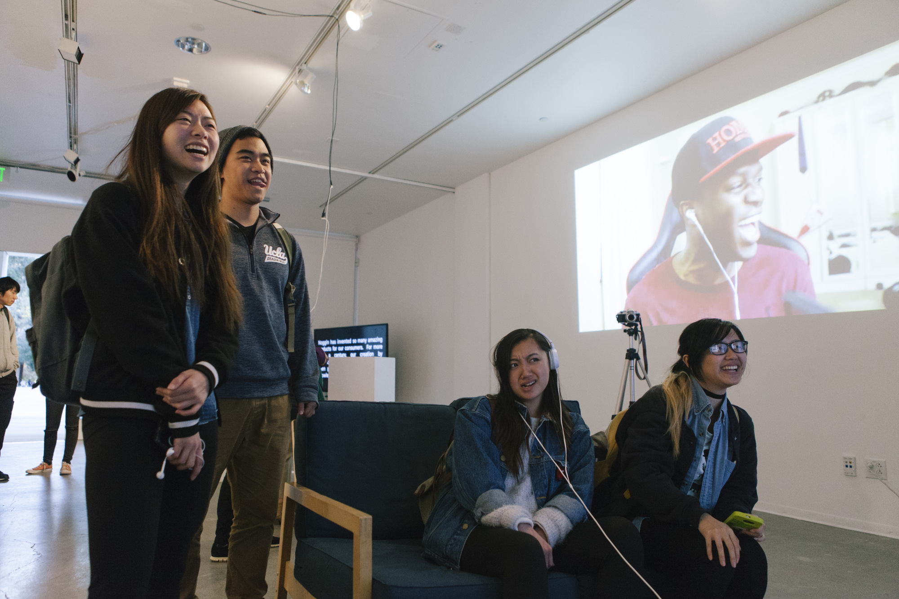

## Banksy in us

[Github Repo](https://github.com/youjinChung/BanksyInUs) | [Instagram](https://www.instagram.com/nychristmas2017/)

Banksy in us is a project that prints out a holiday theme postcard with a photo image of a user. By face recognition, users are encouraged to make funny faces that match popular gif images. To compare the facial expression, extracted facial points using FaceOSC, and compared the ratio of coordinates.  

When the app takes a photo image, users can make a postcard image that looks like Banksy graffitis.

The final selected postcard image is also printed out as a souvenir, and it can be uploaded to Instagram account if they agree with.

## Algorithm

Sample clips are pre-analyzed with the coordinates of key facial points: Orientation coordinate(x,y,z), Eyebrow heights(left, right), Eye heights(left, right), nose coordinate, mouth width and height. These data are stored in the app, and compared to the user face coordinated to compare the facial expression similarity. The app does not simply compare the coordinates; it compares the ratio of components of the face and the orientation point. This algorithm is devised to deal with different facial structures and the distance from the camera. When the score based on the similarity approaches the threshold, the camera takes a photo of users.

## System

FacsOSC: Face Recognition 
Processing: Whole Structure 
Webcam: Face image Input 
Printer: Postcard Output

## Role

Programming, System Architecture

## Credit

[Namsoo Kim](https://www.vincentnskim.com/): UX design, Documentation

Featured at ITP Winter Show 2017 
Winter 2017  

* * *

## iCeleb

[Github Repo](https://github.com/youjinChung/iCeleb)

iCeleb is the prior version of Banksy in Us. It proved the concept of face recognition game. Compared to Banksy In Us which is more like photobooth style interaction/experience, iCeleb accents on game experience that allows players to practice the signature facial expressions of Youtube influencers.

## System

FacsOSC: Face Recognition 
Processing: Whole Structure 
Webcam: Face image Input

## Role

System Architecture, Programming

## Credit

[Tuangkamol Thongborisute](https://tuangstudio.com/): Concept, UX Design, Documentation

Featured at UCLA Design|Media Arts Solo Show by Tuang Thongborisute 
Los Angeles, Spring 2017