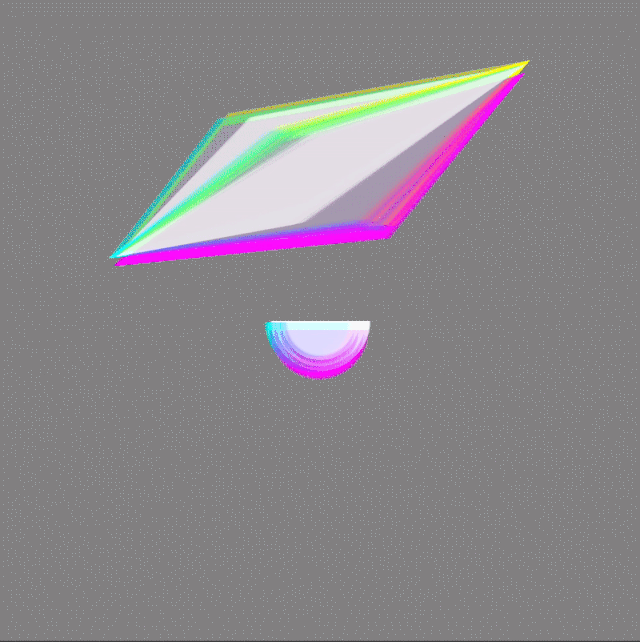
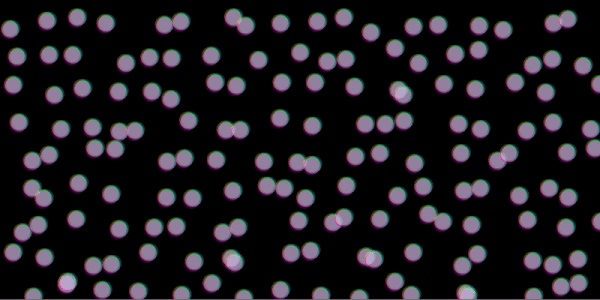

# Glitch

**_Code and Excutable Demo [[Stand Alone Version](https://editor.p5js.org/eloquentify/sketches/S1MyzhcpZ) | [Sensor Input Version](https://editor.p5js.org/eloquentify/sketches/rJPRZ7j6Z) ]_**

__

  

_**[Code and Excutable
Demo](https://editor.p5js.org/eloquentify/sketches/Sk1-Dhq6Z)**_

  

Glitch is P5.js sketches for glitch visual programming. The upper sketch can
work by itself or can be interactive to the sensor input of an Arduino.  
  

## System  

Javascript, HTML, CSS, P5.js, Arduino, Socket Communication (Arduino <->
P5.js)  
  

## Role  

Concept, Programming  

New York, Fall 2017
