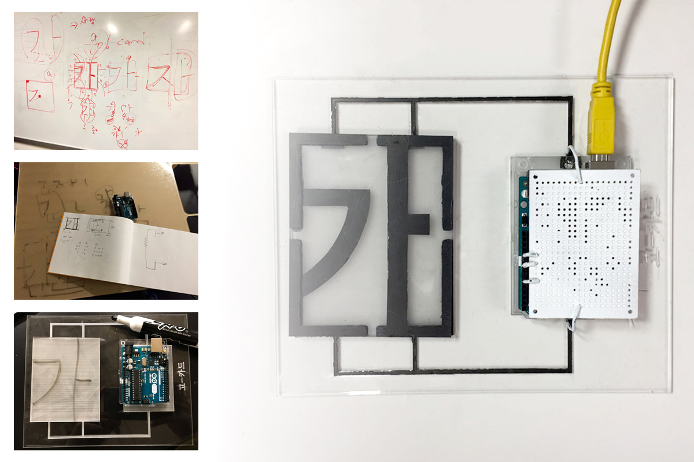

# Go Card

<em><strong><a href="https://github.com/youjinChung/GoCard">GitHub Repo</a></strong></em> <em>NYU ITP project</em>

<iframe src="https://player.vimeo.com/video/294069117" frameborder="0" allow="autoplay; fullscreen; picture-in-picture" allowfullscreen></iframe>

  

    
    
    
    
    
  

  <button class="carousel-btn prev" onclick="moveGocardCarousel(-1)">&lt;</button>
  <button class="carousel-btn next" onclick="moveGocardCarousel(1)">&gt;</button>
  

Go Card is a concept of language education kit.  
The Korean letters are written in syllabic blocks with each alphabetic letter
placed vertically and horizontally into a square dimension. Using that
characteristic, we designed an education kit for learning Korean letters.  
We chose “ㄱ" + “ㅏ” = “가“, 가 is the most simple and basic letter when you learn
Korean as we learn A, B, C in English. 가 also has a meaning of ‘Go’, so we
named our kit as Go Card.  
  

## System  

Each vowel and the consonant card has its own sound. The user can hear them
when they press the card on the kit.  
When they stack the cards together, they can learn how the consonant and the
vowel combine to make a sound.  
  
The kit is designed with acrylic sheet and conductive paint, and an Arduino
board. Programmed with P5.js.  
Using the different lenght of each letter's stroke, we designed each sound
'ㄱ', 'ㅏ', and '가' to have different resistance.

<iframe src="https://player.vimeo.com/video/294069607" frameborder="0" allow="autoplay; fullscreen; picture-in-picture" allowfullscreen></iframe>

## Role

Ideation, Design, Programming  
  

## Credit

[Dongphil Yoo](http://dongphilyoo.com): Ideation, Fabrication, Documentaion