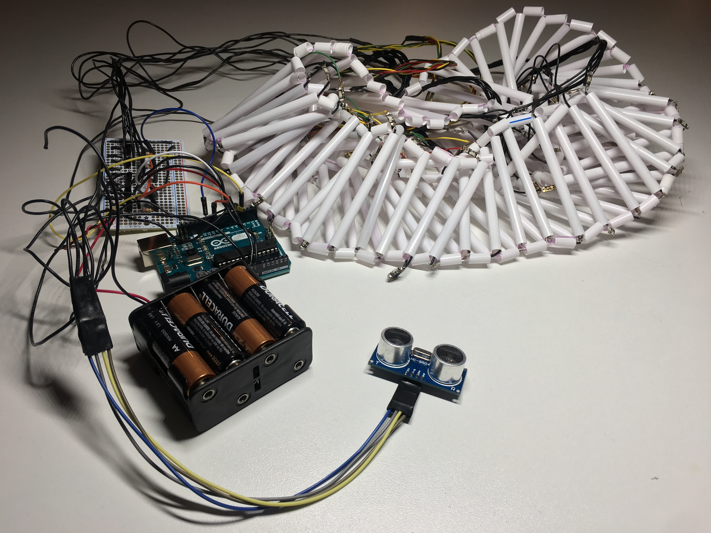
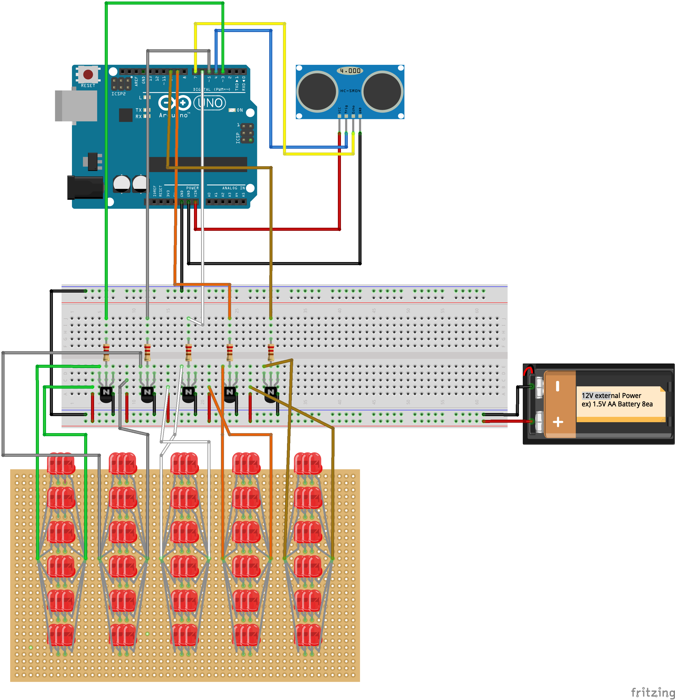

# Humanphobia

<em><strong><a href="https://github.com/youjinChung/Humanphobia">GitHub Repo</a></strong></em> <em>NYU ITP project</em>

<iframe src="https://player.vimeo.com/video/318152790" frameborder="0" allow="autoplay; fullscreen; picture-in-picture" allowfullscreen></iframe>

Humanphobia is an interactive light art wearable.  
This project refers to social anxiety, inspired by the cover art of "Awaken,
My Love!", Childish Gambino.  
  
Calculating the distance from the other, the mask shows five different light
pattern.  
{Idle} - {Random} - {In order} - {Strobe} - {All lights on}  

  

## System

Arduino, Ultrasonic sensor, 90 LEDs  
  

## Role  

Concept, Programming, Fabrication, Documentation  
  

## Credit

[Dongphil Yoo](http://dongphilyoo.com): Documentation