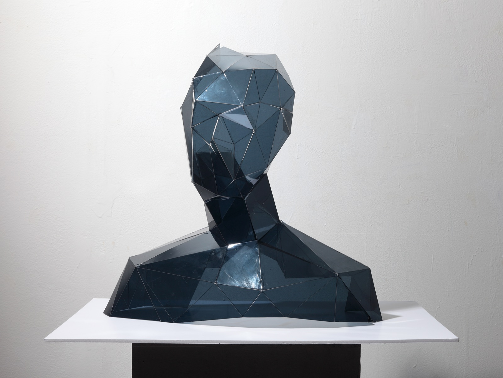
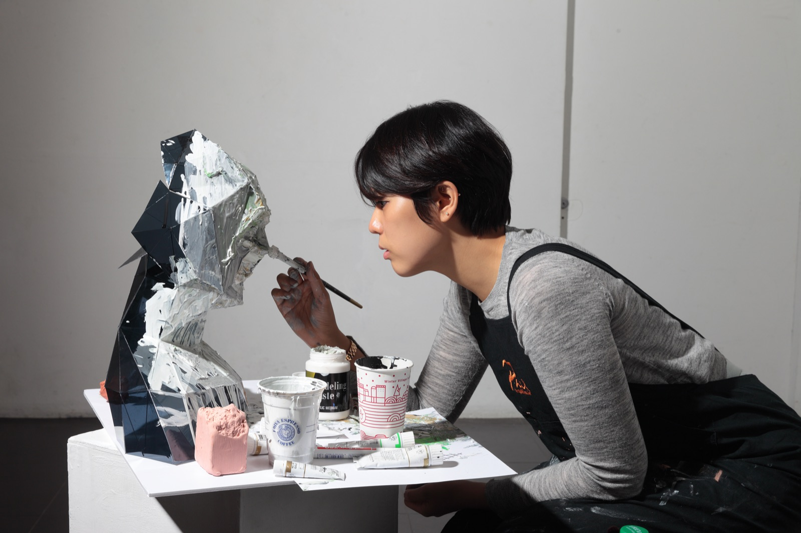
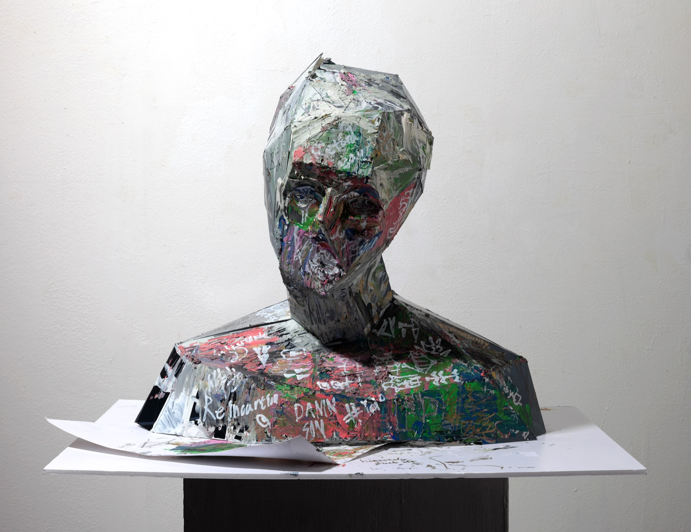

# Misunderstood

Misunderstood is a sculpture about the distance between a person and the way others see them. I began with a bare low-poly bust, a face with nothing on it. Then I buried that surface under frantic layers of paint and scrawled words: the expectations, assumptions, and prejudices we pile onto someone the moment we look at them. The form underneath never changes; only the surface that others project onto it does. The piece asks how much of what we think we see in another person is really them, and how much is the image we have already painted over them.

<iframe style="position:absolute;top:0;left:0;width:100%;height:100%;" src="https://www.youtube.com/embed/His3b5PdBZs" frameborder="0" allow="accelerometer; autoplay; clipboard-write; encrypted-media; gyroscope; picture-in-picture" allowfullscreen></iframe>

 

## Process

The bust started as a low-poly 3D model. I unfolded it into a flat papercraft net with Pepakura, then cut, scored, and folded the panels by hand into a physical sculpture.

Once the clean faceted form was assembled, I painted over it, covering the calm geometry with dense, restless marks until the original face was almost lost beneath them.

The finished piece carries both states at once: the quiet form underneath, and the noise of everything projected onto it.

