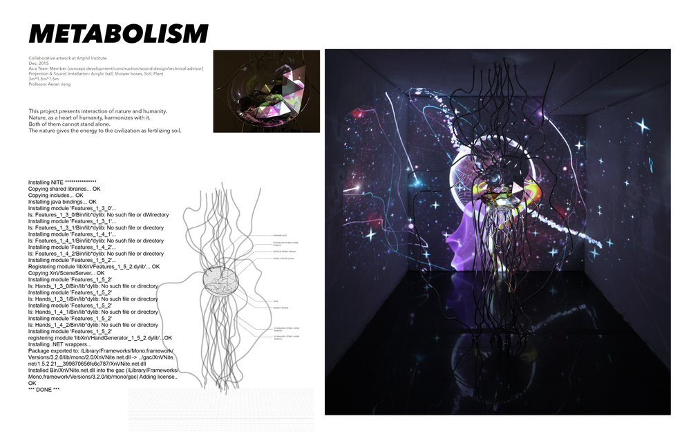
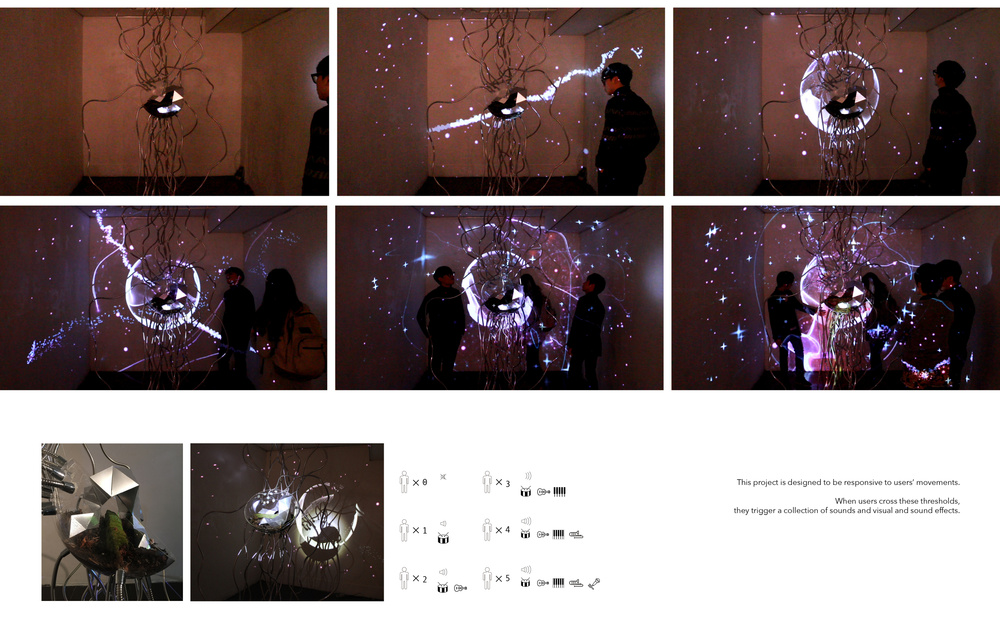

# Metabolism

Collaborative artwork at Artphil Institute  
As a Team Member [concept development/construction/sound design/technical
advisor]  
Projection & Sound Installation: Acrylic ball, Shower hoses, Soil, Plant  
3m*1.5m*1.5m  
Professor Aeran Jung  
  
  
This project presents interaction of nature and humanity.  
Nature, as a heart of humanity, harmonizes with humanity.  
Both of them cannot stand alone.  
Nature gives the energy to the civilization as fertilizing the soil.  
  
This project is designed to be responsive to users’ movements.  
When users cross these thresholds, they trigger a collection of sounds and
visual and sound effects.