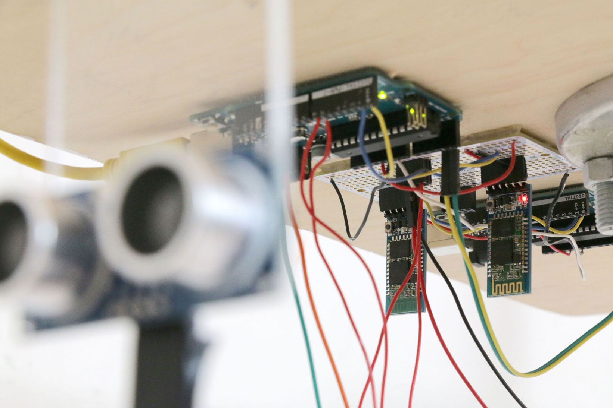
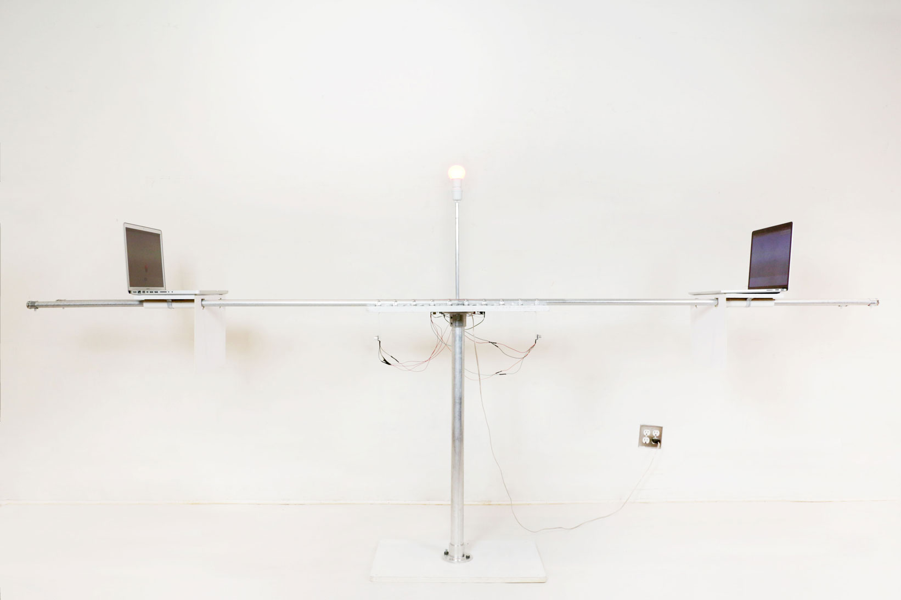
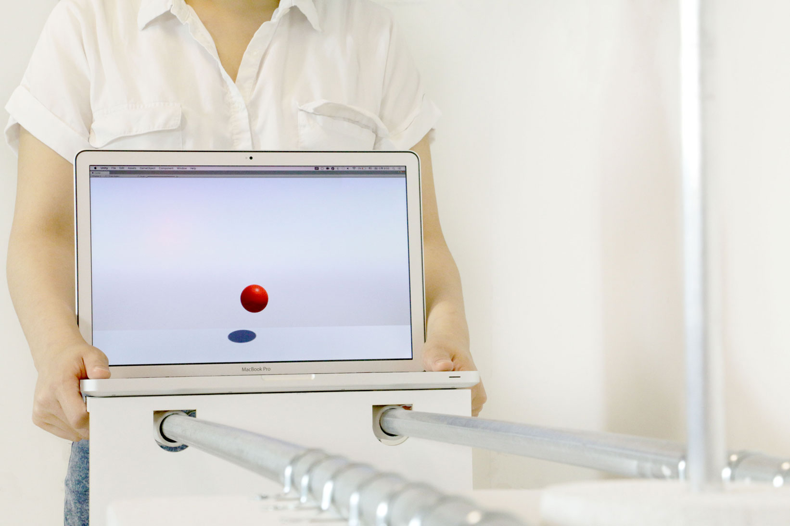

# One Zero

** _[GitHub Repo](https://github.com/youjinChung/OneZero)_**

  
  

  
One Zero is Interactive Kinetic Art Installation.  
The project implies the coexistence of the human cognitive process and machine
perception.  
  
The red ball travels between two laptops and the bulb lights on when the ball
passes through right in the middle of the virtual world.  
The audience can move laptops back and forth, and their positions get updated
to the virtual world in real-time.  
The installation shows the trace of the red ball in mixed reality.  
  
This project is shown at ITP 2018 Spring Show.  
  

* * *

  

## System

Unity 3D, Arduino, Ultrasonic, Bluetooth, I2C communication  

  

Two ultrasonic sensors calculate the distances between each laptop and the
pole in the middle and send them to Arduino.  
The master Arduino board collects the positions of two walls and a ball in the
unity and controls the light bulb.  
Each Arduino communicates with their ultrasonic sensor and unity via
Bluetooth, and two Arduinos communicate with each other via I2C.  
Unity3D physics engine calculates the movement of the ball with the distance
information.  
  

## Role  

Ideation, System architecture, Programming (Arduino, Unity3D)  
  

## Credit

[Dongphil Yoo](http://dongphilyoo.com/): Concept, Fabrication  
  
  

Featured at ITP Spring Show 2018  

> New York, Spring 2018