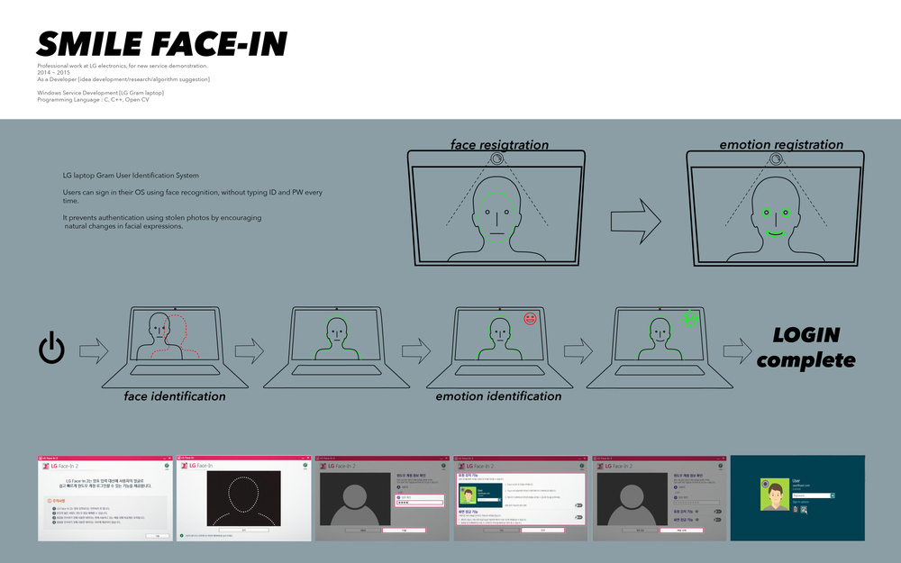
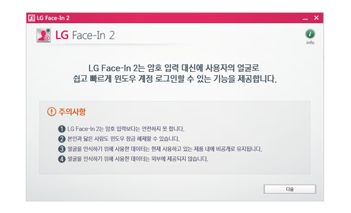
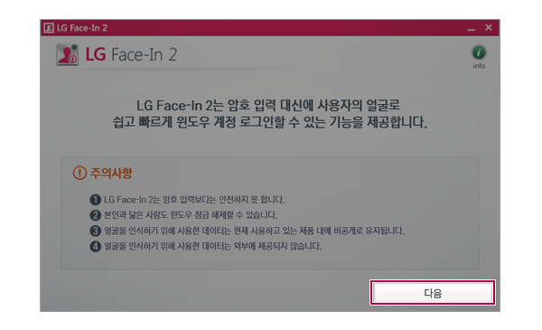
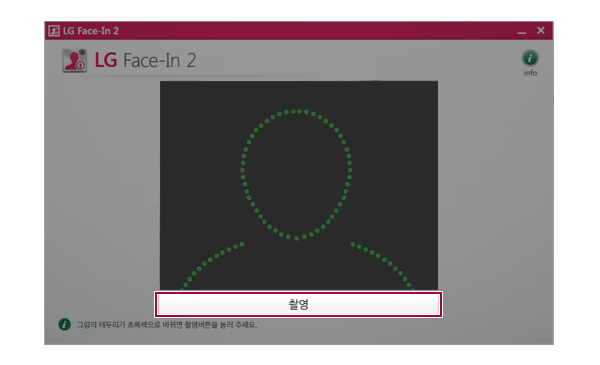
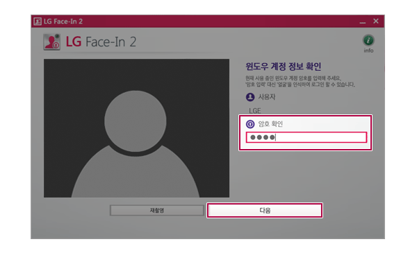
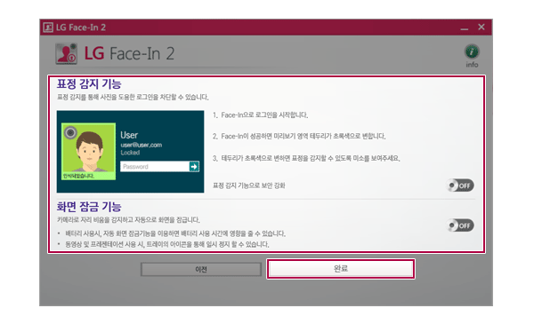
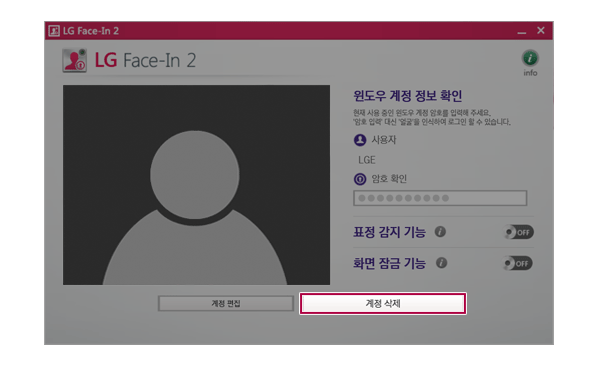

# Smile Face-in

  
LG laptop Gram User Identification System  
Users can sign in their OS using face recognition, without typing ID and PW
every time. It prevents authentication using stolen photos by encouraging
natural changes in facial expressions.  

## System  

C, C++, LG face recognition ML engine  
  
Windows Service Developmen  
Implemented for LG Gram laptop  
  

## Role  

Ideation, Research, Algorithm  
  

Professional work at LG electronics  
Seoul, 2014-2015