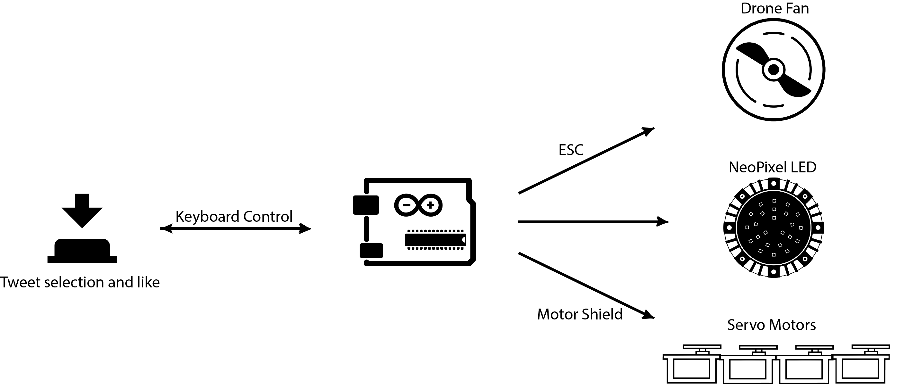
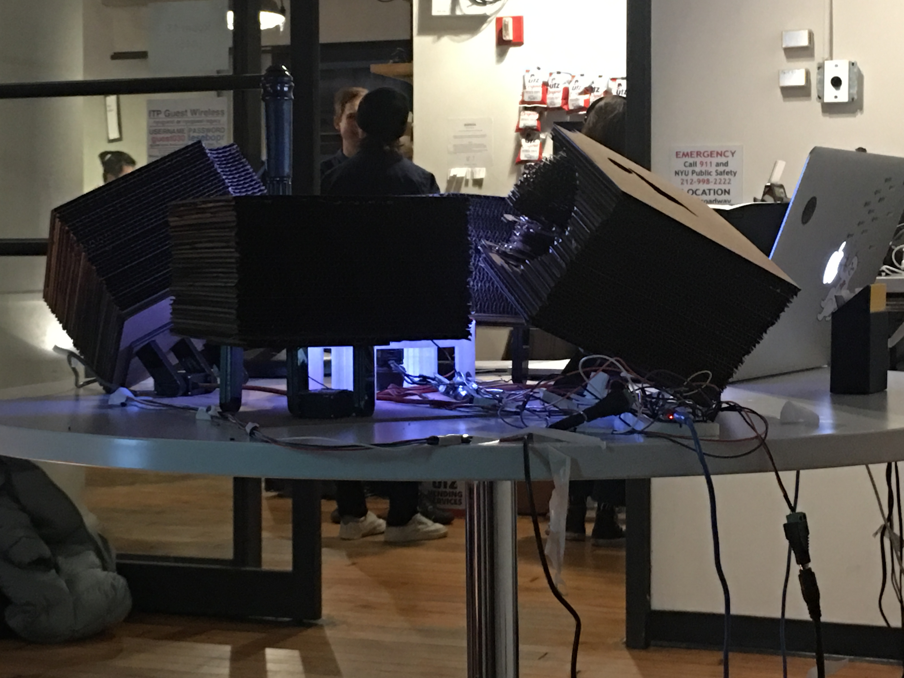

# *Sigh*  

_**[Github repo](https://github.com/youjinChung/TheMachineSighs)**_  

  
  

  
*Sigh* started from a question: What if machine sighs? Having paralingual expressions is one of the critical differences to distinguish machines from humans. Since machines don't have identical biological structure as humans, they don't need paralingual expressions such as sigh, gasps or throat-cleaning. Rather, the imitation of those paralanguage yields uncanniness to the audience.   
In this project, the human users browse a Twitter home feed. When they found
any interesting feed and "like" the tweet, the machine sitting beside the
users *sigh*. To see the machine's reaction over and over again, the user
became a 'machine' to push like button repeatedly while the machine sighs at
times as if it is human.  
  

## System

  

  

  
  

  
  

## Role  

Concept, Ideation, Design, Programming, Fabrication  
  

## Credit

[Namsoo Kim](https://vincentnskim.com): 3D modeling, Fabrication  

Featured at ITP Winter Show 2017  
New York, Winter 2017