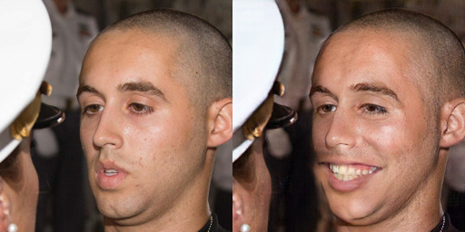
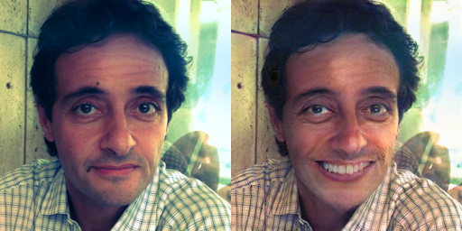
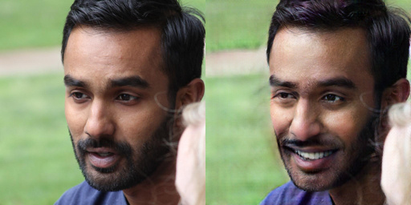
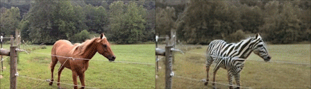
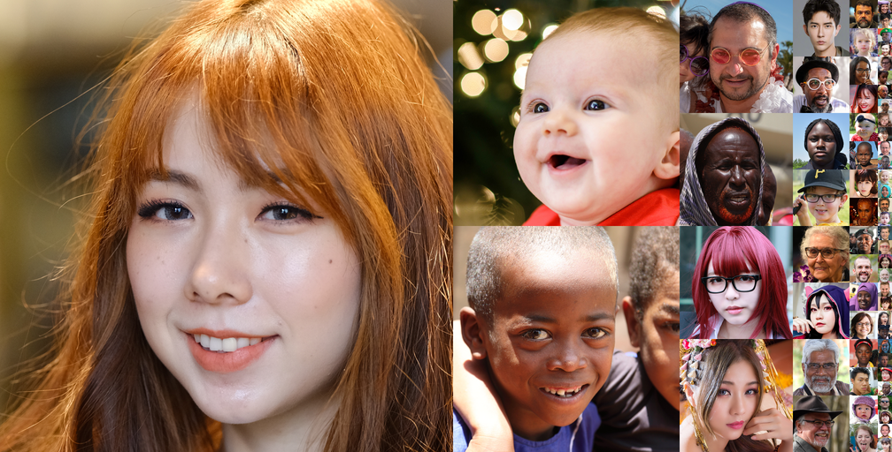
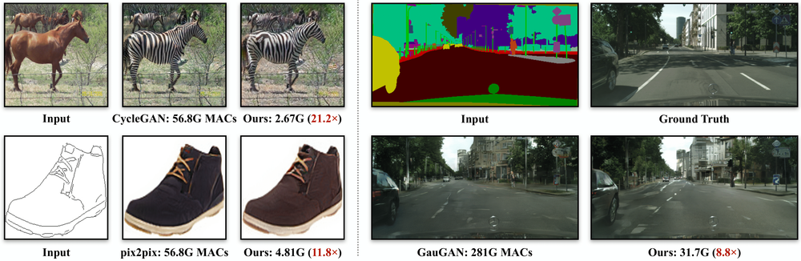

# Smile Filter:  
Cycle GAN + GAN Compression  

  
  
  

  

left: input right: output  

Welcome to my Smile Filter project, where I utilized CycleGAN to transform
facial expressions from normal or unhappy faces to happy faces with mouth
expressions. This project aims to demonstrate the power of image-to-image
translation using unpaired datasets and how it can be applied to improve the
emotional expressions in images.  
  

## CycleGAN

CycleGAN is an effective deep learning model for image-to-image translation
with unpaired datasets. It works best when the input and output have similar
geometric constructions, such as apple-orange or horse-zebra. For this
project, I utilized CycleGAN to transform normal or unhappy facial expressions
to happy expressions with mouth expressions.  
  

## Dataset

To train the CycleGAN model, I used the Flickr-Faces-HQ Dataset (FFHQ), a
high-resolution dataset containing 5055 images with a resolution of 256 x 256
pixels. I categorized the images into two groups based on their facial
expressions: normal or unhappy faces and happy faces with mouth expressions.  
  

## Training  

The training of the model was performed on AWS EC2 p3.8xlarge, which is
equipped with four Tesla V100s of 64GB GPU memory. I used the Compression And
Teaching (CAT) framework in PyTorch for training the teacher models. Then, I
employed GAN compression to reduce the size of the model, enhance the frame
rate, and reduce the computational cost. Finally, I exported the model into
ONNX format.  
  

## Running model on mobile  

  

The GAN compressed model can be easily deployed on mobile devices, enabling
real-time facial expression transformations. This provides a seamless user
experience and makes it easier to integrate the model into various
applications.  
  

## Conclusion  

In summary, my Smile Filter project demonstrates the power of CycleGAN for
image-to-image translation and how it can be utilized to improve facial
expressions in images. The use of GAN compression reduces the size of the
model, making it suitable for deployment on mobile devices. I hope this
project inspires further research and applications in the field of computer
vision.  
  

# Reference

[NVlabs - Flickr-Faces-HQ Dataset (FFHQ)](https://github.com/NVlabs/ffhq-
dataset)  
[Compression And Teaching (CAT)](https://github.com/snap-research/CAT)  
  

2022-2023