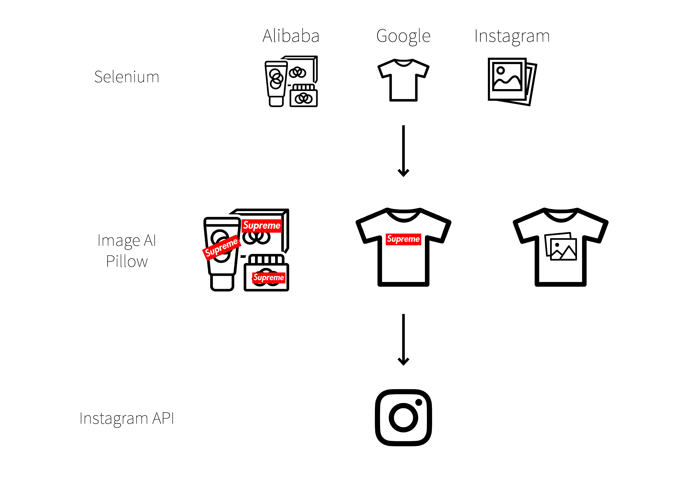

# Suprememe

<em><strong><a href="https://github.com/youjinChung/Suprememe">GitHub Repo</a></strong></em> | <em><strong><a href="https://www.instagram.com/suprememebot/">Instagram</a></strong></em> <em>NYU ITP project</em>

<iframe src="https://player.vimeo.com/video/322192045" frameborder="0" allow="autoplay; fullscreen; picture-in-picture" allowfullscreen></iframe>

Suprememe is an automated Instagram bot, which generates product and T-shirt
images of Supreme aesthetics.  
It collects random product, garment images and detects objects in the images
to put the Supreme box logo or graphics on them.  
From collecting images, detecting objects, compositing, to posting to the
Instagram account, every step is automated.  
  
This account, not only generating images but also being liked and followed
other accounts (who probably are not checking what they are liking at all,) is
the archive of supreme fandom itself.  

  

    
    
    
    
    
    
    
    
    
    
    
    
  

  <button class="carousel-btn prev" onclick="moveSuprememeCarousel(-1)">&lt;</button>
  <button class="carousel-btn next" onclick="moveSuprememeCarousel(1)">&gt;</button>
  

## System

[Selenium](https://www.seleniumhq.org/),
[ImageAI](https://github.com/OlafenwaMoses/ImageAI/tree/master/imageai/Detection),
[InstagramAPI](https://github.com/LevPasha/Instagram-API-python),
[Pillow](https://pillow.readthedocs.io/en/stable/#)  
  
1\. It grabs images from websites: a product image from Alibaba, a white
T-shirt image from Google, a graphic image from Instagram(#glitch). All images
are chosen randomly.  
2\. It detects objects in a product image, or a T-shirt image, and choose one
object among them.  
3\. It puts the Supreme box logo if the chosen object is a product image or a
T-shirt image, or it puts a graphic image on the chosen T-shirt image.  
4\. It posts the composited image to [the Instagram
account.](https://www.instagram.com/suprememebot/)  
  

## Role

Concept, Programming