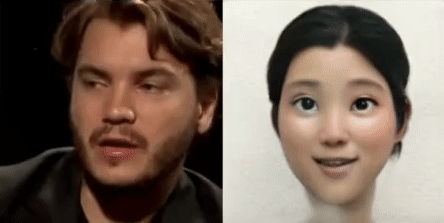
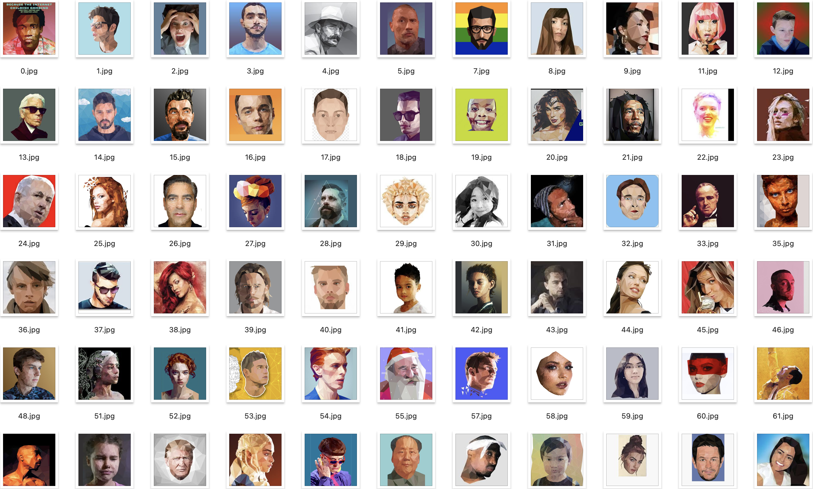
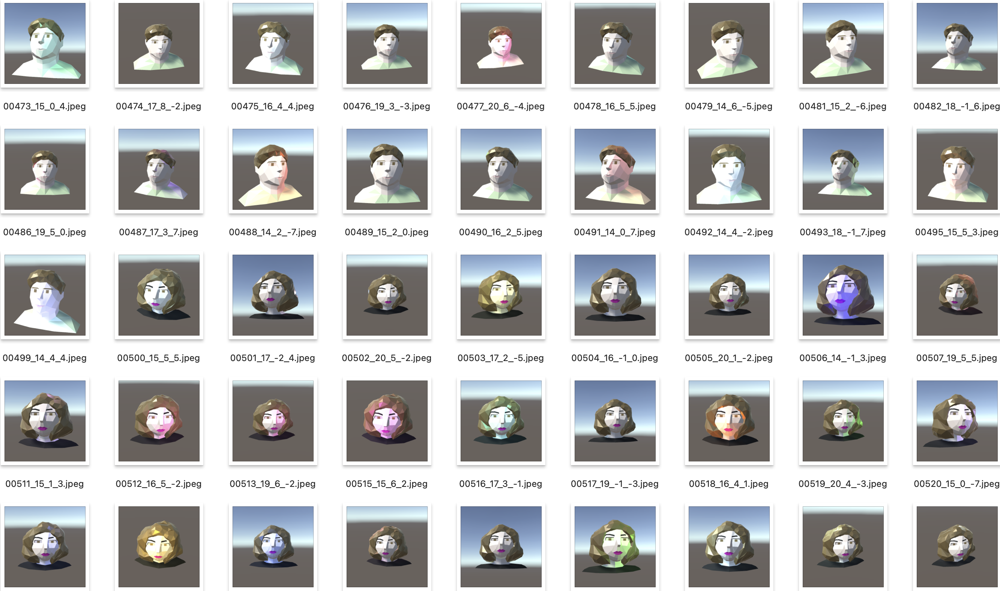

As a further step to my Smile Filter project, I explored the capablities of
StyleGAN for image-to-image translation of cartoon faces. This project aimed
to transform human faces into cartoon-style portraits using deep learning
techniques.  

  
  

## Training  

To train the StyleGAN model, I first finetuned a StyleGAN2 model on a cartoon
dataset and created a cartoon-model. I then blended this model with an FFHQ
face model to generate a lot of pair data containing fake human faces vs.
cartoon images. I generated approximately 18,000 pairs of data, which I used
to train a pix2pixHD model for image-to-image translation.  
  
To achieve the desired results, I considered various factors such as variety
of low-polies, resolution, model configuration, and training steps. I
collected web low poly portraits and captured various images of them from
various angles to create a diverse and rich dataset.  
  
  

## Application  

The trained pix2pixHD model was exported to ONNX format and imported into Lens
Studio for real-time transformation of human faces into cartoon-style
portraits. This can be used to create fun and engaging filters for social
media platforms and other applications.  
  

## Conclusion  

In conclusion, my StyleGAN Toonify project demonstrates the power of deep
learning techniques such as StyleGAN and pix2pixHD for image-to-image
translation of human faces into cartoon-style portraits. With the right
training data and model configuration, we can achieve stunning results that
are useful for a variety of applications. This project is still in progress,
and I plan to continue exploring the capabilities of StyleGAN for image-to-
image translation.  
  

2022