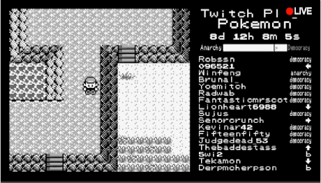

# Tweet Reader

For expressive interaction, I made a chrome extension that reads tweets that I expand the card.

Here's the video of it. Check the code from [GitHub](https://github.com/elqtfy/tweetreader). Referenced from [Speak Selection](https://developer.chrome.com/extensions/samples#search:tts) of Chrome extension examples.

It was the first attempt to use chrome extension, so I just made it as easy and quick, but I think I could push through to make it more expressive. I tried to use Twitter API for the first time, but it is only for subscribing the authorized account. BeautifulSoup/Puppeteer could make the work easier, but I am not sure it also applies to already open window. As far as I understood, it is more for automated scraping. Therefore, I used vanilla javascript to access the tweet contents.

- Now my twitter account is set in Korean. It might affect the way it parses the tweets.
- I am using the basic Chrome TTS engine, but I guess I can make the voice more expressive by using other engines (Watson expressive SSML again, or changing the rate/pitch/volume).

* * *

# Left or Right

## Goal

This project started with the simple idea to combine two class projects together: Dynamic Web Development and Expressive Interaction - Voice. The key requirements are: (0) network communication and (1) use VUI for that. So Phil and I came up with the idea of making a multiuser game using voice interaction. The key concept that we settled on was letting users interact with their voice at the same time, even though the gameplay experience is not quite operated or delivered. The picture in my mind was a bunch of people shouting to the game nearby, together or separately, and the narration helps/hinders the gameplay. I wanted to realize the mess of all the people shouting and hearing each other—it's a bit of a participatory performance.

## Persona

There were references that inspired us. Basically, the game targets users sitting in the same place as the ideal situation, so I can document it as a performance. All users have laptops and use the default mics as input devices. The game will play narrations also, so the voice from other users and the narration will be interruptive inputs together.

- [Twitch Plays Pokémon](https://en.wikipedia.org/wiki/Twitch_Plays_Pok%C3%A9mon): Multi-user interaction to control one object together.

- [Last Man Standing](https://pheonise.itch.io/last-man-standing): Multiuser interaction using the same objects, but separately.
- [clickclickclick.click](https://clickclickclick.click/): Web-based interaction idea and narration persona.
- [Stanley Parable](https://youtu.be/w3UxRa_-9UU): Narration persona.
- [Stranger than Fiction](https://www.youtube.com/watch?v=JqLqO9-z0go): Narration persona.
- [Portal GLaDOS](https://www.youtube.com/watch?v=qwDCk68uoSQ): Synthetic narration.

## Voice

The narrator persona:
- Male vs. female: Since most authoritative narration uses male voices, I am interested in trying female authoritative voices.
- Synthetic vs. voice acting: Using a voice actor would be easier to deliver [paralanguage](https://en.wikipedia.org/wiki/Paralanguage#Sighs) (sighs, gasps, throat clearing, mhm...), but using synthesized voice for the experiment purpose is also interesting.

So the voice will be a synthetic, female voice that has an authoritative, sarcastically humorous, joking personality but makes you feel inhumane somehow (she knows that she doesn't have a physical body in the real world).

It would be great to show some expressions also (like Watson expressive SSML), but there are not many voice synthesis engines that have expression features together. If I cannot express emotions naturally, rather an artificial sounding voice would be better (users will excuse the hidden emotion expression).

Ultimately, it would be perfect to make a neutral-female sounding synthetic voice that has emotional expression.

## Further Steps

1. Interaction Flow
2. Script
3. User Testing

During the classes, Expressive SSML was the most impressive voice synthesis. I decided to use this as the narrator.

Scraped tweets with the keywords left and right. #Left and #Right was much stronger, but I needed to parse the hashtags out, so I just used left and right (now I think I should refine texts more).

March 23, 2018

* * *

# Project Proposal

## Goal

Make a web, asynchronous experience for multiple users, about behavior jamming.

## User

Indie game players who are familiar with web-based interactions.

## Find Your Voice

A female voice that is authoritative, but gentle at the same time. Humorous/sarcastic personality.

## Dialog Flow / Interaction Flow

Reference: [clickclickclick.click](https://clickclickclick.click/)

February 21, 2018

* * *

# Redundant Eliza

Speaking to VUI was always awkward, no matter which application/service. In fact, Siri is the only service that I have used so far. Maybe the reason I avoid speaking in front of people is that I am the youngest one in a big family. For any reason, I have avoided giving information to the public, especially in English.

That awkward feeling continued when I assembled the AIY kit. Testing the command on the floor while everybody is listening to me was not easy. We can find that kind of situation with a real person in real life also—the awkward feeling when you consistently overlap while the other person is speaking and both keep yielding to speak first.

> A, B: so... 
> A: you go first. 
> B: No, you can talk first. 
> (infinite loop)

Maybe this does not happen in other cultures, but I guess it is pretty common in Korea, which appreciates polite attitudes in conversation. Anyway, this overlap makes you awkward to talk since you are interrupted. Hearing something while you are trying to say something makes your brain jammed.

[Speech-Jamming Gun in Public Spaces](https://www.technologyreview.com/s/427116/how-to-build-a-speech-jamming-gun/)

So I came up with an idea of making a chatbot that maximizes awkwardness in conversation. The personality of the voice is arrogant and sarcastic, so it keeps pretending to miss the conversation, answers in a very sarcastic way, and does not do its job.

So the key function is managing the time when the user listens to themselves. In order to do that:

1. The program needs to record the user's command.
2. It can play the recorded sound (hopefully right back) to the user so the user cannot keep talking.
3. Even if the user succeeds in delivering the command, the AI answers in a sarcastic way.

Hope it was true to me also... [Teaching AI how to be sarcastic is totally the easiest thing ever](https://qz.com/801813/teaching-ai-how-to-be-sarcastic-is-totally-the-easiest-thing-ever/)

I started with the example codes in AIY source. Long story short, I failed. These are what I figured out after 6 hours of programming:

1. Using assistant APIs doesn't support managing which answers the AI gives. In this case, other people made their own chatbot, but I wanted to 'hack' the chatbot while keeping the structure of it. (That's the reason I needed to use either gRPC or the Google Assistant library.)
2. To record and play back, multi-threading is required. When I saw [assistant_library_with_button_demo.py](https://github.com/google/aiyprojects-raspbian/blob/aiyprojects/src/examples/voice/assistant_library_with_button_demo.py), multi-threading looks possible, but I could not figure out how to do it.

So what I did is just make it keep repeating to the user to make them annoyed, and randomly deny to 'assist' them.

As a result, it sounds more like [ELIZA](https://en.wikipedia.org/wiki/ELIZA) than contemporary AIs we have. It was supposed to turn off and show the YouTube video when the user says 'awkward', but the processor was too slow and showed the link late, which made me embarrassed.

[Here is the code.](https://github.com/Eloquentify/Voice2018/blob/master/reduntdantELIZA.py)

February 16, 2018
