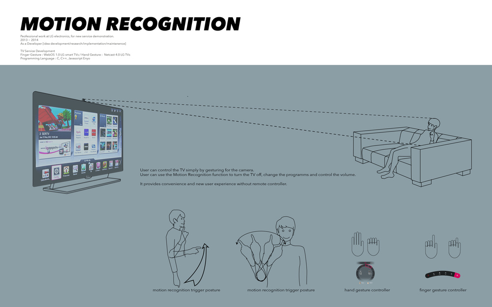
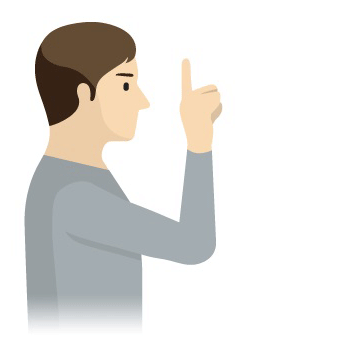
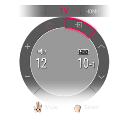

[ ︎ ](/Left-Nav)

**[Youjin Chung](Home)**  
  
[︎](https://www.linkedin.com/in/youjin-chung/) | [︎](mailto:yjc433@nyu.edu) | [︎](https://github.com/youjinChung)   
  
[#ML](https://youjin.io/ML)  
[#XR](https://youjin.io/XR)  
[#Data](https://youjin.io/Data)  
[#Interactive](https://youjin.io/Interactive)  
  
[Archive](blog-1)  
  
  
  
****

# Motion Recognition

  
**What is Motion Recognition?**  
You can control the TV simply by gesturing for the camera.  
You can use the Motion Recognition function to turn the TV off, change the
program, and control the volume.  
A panel appears that enables you to control the signal input, volume, channel,
etc., of the TV using motion recognition.  
  

**To use the Motion Recognition function [Finger Gesture]**

  1. Look at the camera and lift your hand near your face with your index finger straight and pointing up while watching TV. The motion recognition controller appears on the TV screen. 
  2. Move your hand left or right to select a function. Bend and then straighten your index finger to start the function.
  3. With your hand curled up in a fist, bring the middle joint of your index finger close to the center of your lips. This will execute the Mute command.

**To use the Motion Recognition function [Hand Gesture]**

  1. Stare at the camera while the TV is on and hold your hand up close to your face. The motion recognition controller appears on the TV screen.
  2. Move your hand left, right, up or down to select a function. Close and open your fist to start the function.
  3. If you lower your hand out of the range of motion recognition, the controller disappears from the screen.
  4. If you clench your fist for more than one second, the selected function is performed repeatedly until you open your hand.

  
  
  

## System  

C, C++, Javascript, LG motion recognition ML engine  
  
SmartTV Service Development  
Finger Gesture : Implemented in camera built-in WebOS 1.0 LG smart TVs  
Hand Gesture : Implemented in camera built-in over Netcast 4.0 LG TVs  
  

## Role  

Ideation, Research, Implementation, Maintenance  

  
Professional work at LG electronics  
Seoul, 2013-2014

  

