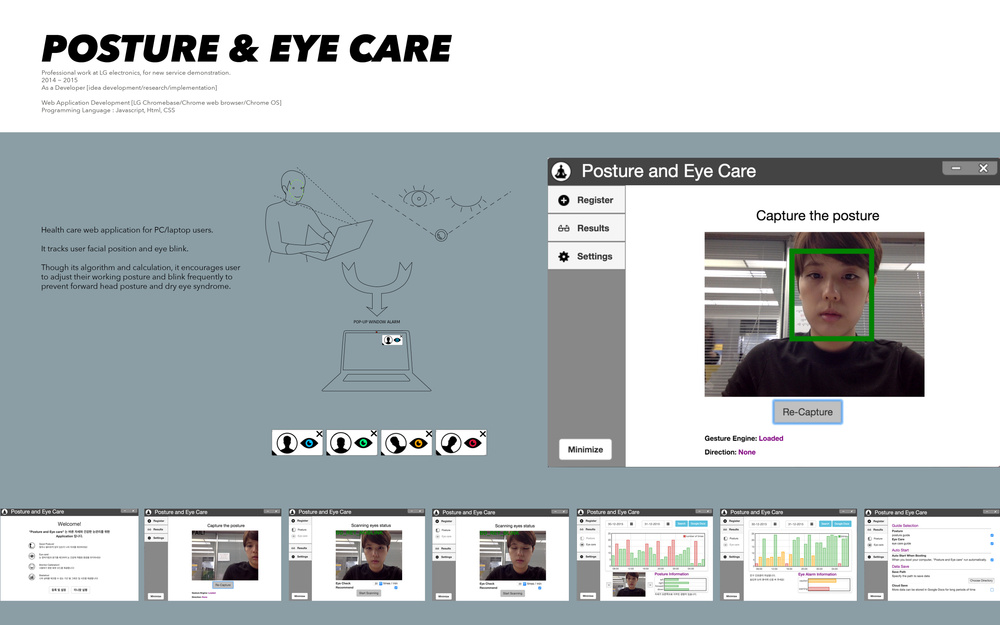

[ ︎ ](/Left-Nav)

**[Youjin Chung](Home)**  
  
[︎](https://www.linkedin.com/in/youjin-chung/) | [︎](mailto:yjc433@nyu.edu) | [︎](https://github.com/youjinChung)   
  
[#ML](https://youjin.io/ML)  
[#XR](https://youjin.io/XR)  
[#Data](https://youjin.io/Data)  
[#Interactive](https://youjin.io/Interactive)  
  
[Archive](blog-1)  
  
  
  
****

# Posture & Eye care

** _[Github repo](https://github.com/youjinChung/PostureEyeCare)_**  

  
Healthcare web application for PC/laptop users.  
It tracks user facial position and eye blink.  
Through its algorithm and calculation, it encourages the user to adjust their
working posture and frequently blink to prevent slouching and dry eye
syndrome.  

  
  

## System  

Javascript, HTML, CSS, LG face recognition ML engine  
  
Web Application Development  
implemented for LG Chromebase, Chrome web browser, Chrome OS  
  

## Role  

Ideation, research, implementation, programming  
  

Professional work at LG electronics

Seoul, 2014-2015  

