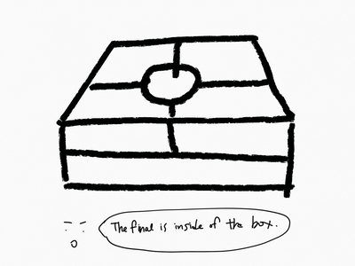
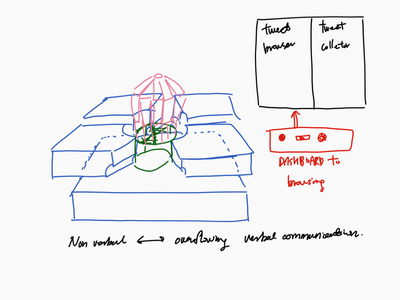
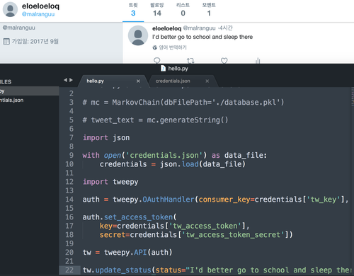

[ ︎ ](/Left-Nav)

**[Youjin Chung](Home)**  
  
[︎](https://www.linkedin.com/in/youjin-chung/) | [︎](mailto:yjc433@nyu.edu) | [︎](https://github.com/youjinChung)   
  
[#ML](https://youjin.io/ML)  
[#XR](https://youjin.io/XR)  
[#Data](https://youjin.io/Data)  
[#Interactive](https://youjin.io/Interactive)  
  
[Archive](blog-1)  
  
  
  
****

  

* * *

# Sigh Machine project plan

[BOM &
timeline](https://docs.google.com/spreadsheets/d/1-AENoB1LoJ0K8l-bLgaBlDoMUy_pkOZfmNPBecrozOw/edit?usp=sharing)  
[System
Dialog](https://docs.google.com/presentation/d/1etpR7mg_KUNHaXJpjUdZBoV3qrVHpXh28WAURDDQkbw/edit?usp=sharing)  
  
  
Checked how computer cans inflate paper/vinyl balloons, it didn't make much
difference even though those balloon were very thin and light.  
  
While asking about using big fans(ready-made), I was recommended to use the
drone motors for the reason they are programmed to adjust the speed very
accurately.  
  
The key point to deliver the feeling of sighing is stop the fan/fans suddenly
so the ballon can deflate like sigh.  
  
So, we moved to use drone motors.  
  
  
Meanwhile, the whole structure changed a lot also. The plan to use mechanical
ribs changed into using cubes. Technically, the mechanism to inhale is
extending exoskeleton (precisely extending diaphragm using ribs), so we don't
need to obsess with ribs. (And it is simpler and prettier.)

  

And I started to make twitter bots. (Just simple linkage)  
Since we need to show two bots at least, I also need to use
[Selenium](http://selenium-python.readthedocs.io/).  
The twitter account managed by python is
[@themachinesighs](https://twitter.com/themachinesighs)  
The next thing to do is serial communication between arduino{potentiometer to
adjust motors(in the future), python(for twitter and selenium)}.

  
  
November 20, 2017

  

