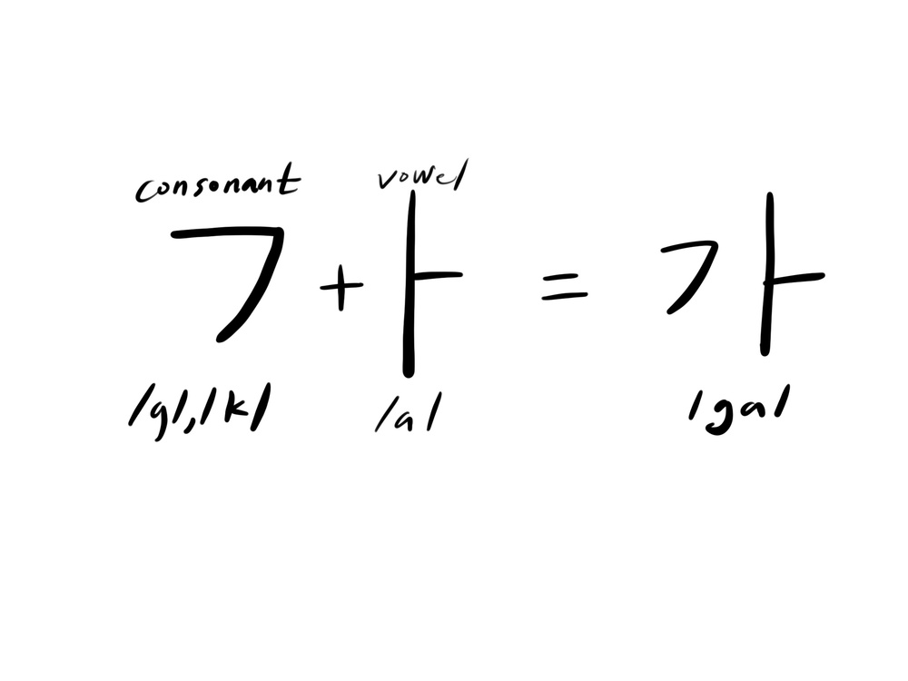
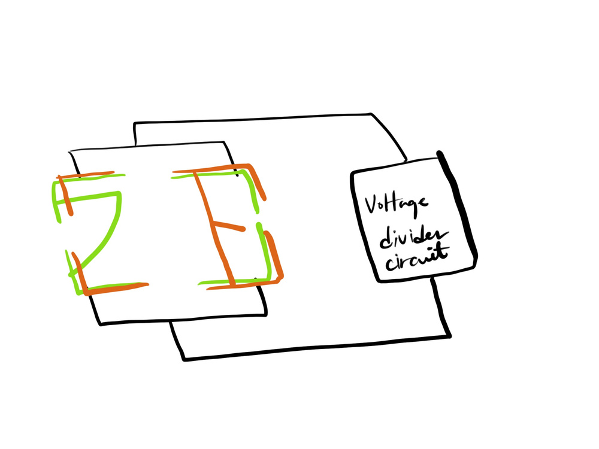

[ ︎ ](/Left-Nav)

**[Youjin Chung](Home)**  
  
[︎](https://www.linkedin.com/in/youjin-chung/) | [︎](mailto:yjc433@nyu.edu) | [︎](https://github.com/youjinChung)   
  
[#ML](https://youjin.io/ML)  
[#XR](https://youjin.io/XR)  
[#Data](https://youjin.io/Data)  
[#Interactive](https://youjin.io/Interactive)  
  
[Archive](blog-1)  
  
  
  
****

  

# Beautiful sensor: Go Card

For the last soft sensing project, we decided to focus on one material -
conductive paint. We are inspired by a circuit book using conductive tape and
paint during the class, decided to make a Korean education kit.  
  
Hangul, Korean letter has an unique system, the letters are assembled to make
a sound. If we use a conductive paint, we can stack each sound/letter card on
each other.  
  
We chose “ㄱ" + “ㅏ” = “가“, 가 is the most simple and basic letter when you learn
Korean as we learn A,B,C in English. 가 also has meaning of ‘Go’, so we named
our kit as Go Card.  
  
Even though conductive paint is rather conductive (as the name says) than
resistive, the stroke to draw each letter is different. We can make parallel
resistance by stacking cards on the kit, and what we need to do is just play
sound. We adjusted the last Angry bird returns code.  
  
Laser cut acrylic board for our card and Arduino spacing.  
  
After we painted conductive paint, and soldered the analog read circuit on the
perf board.  
  
Since the paint is not super durable, but it was good enough to see our
concept works. In the same way, we can extend to different Hangul letters.  
  
  

  

  
October 8, 2018  

* * *

# Research group: Angry Bird Returns

On the second day, we focused on stretch fabric and come up with the idea of
making a slingshot for angry birds. If we measure each fabric while using 3-4
fabrics on the sling shot, we could me not only how tighten the slingshot was,
but also which direction the player intended.  
  
However, in given time, we could only link 2 fabrics on the slingshot and
linked with p5 sketch to indicate the strength.  
  
We used the voltage divider for Arduino part, and used serial communication
for p5.js sketch.  
October 8, 2018  

* * *

# Material testing

Phil and I tested four different materials: Velostat/ Linqstat, Eeonyx
pressure sensing fabric, Eeonyx stretch sensing fabric, and Eeonyx StaTex
conductive fiber. We measured the resistance of them with a multimeter, and
Arduino voltage divider circuit.  
  
These soft sensing materials have tendency of ascending or descending
resistance, but wasn’t linear or consistent.  

>
>     /*Voltage divider with Analogue pin 0*/
>     void setup() {
>      Serial.begin(9600);
>     }void loop() {
>      // read the input on analog pin 0:
>      int sensorValue = analogRead(A0);
>      float voltage = sensorValue*5;
>      Serial.println(voltage);
>      delay(100);
>     }

  
October 8, 2018

