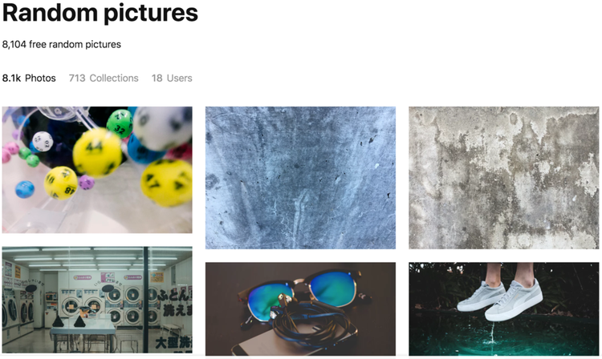
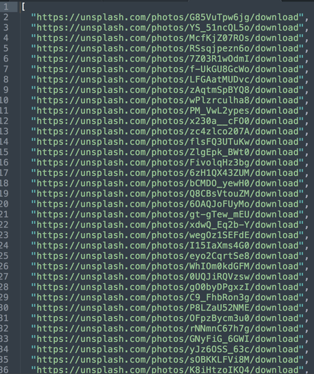

[ ︎ ](/Left-Nav)

**[Youjin Chung](Home)**  
  
[︎](https://www.linkedin.com/in/youjin-chung/) | [︎](mailto:yjc433@nyu.edu) | [︎](https://github.com/youjinChung)   
  
[#ML](https://youjin.io/ML)  
[#XR](https://youjin.io/XR)  
[#Data](https://youjin.io/Data)  
[#Interactive](https://youjin.io/Interactive)  
  
[Archive](blog-1)  
  
  
  
****

# DIY image association test

  
After did some experiment with the
[IAT](https://www.youjin.fyi/blog-1/2018/3/1/rest-of-you-talking-to-the-rest-
of-you-us-implicit-association-test) last time - I was inspired to make my own
association test.  
My test is not sophisticated as the Harvard one, but I come up with the idea
of mixing it up with the Tinder-style swiping UI.  
Many dating apps like Tinder is using left-right swiping UIs. I don't know
their reasoning behind the correlation between the direction of swiping and
the users' favor of the date match or the object, there are some researchers
about the how eye gaze direction is related to inhabited behavior, or
subconscious desires. [The Whites of Your Eyes Convey Subconscious
Truths](https://www.psychologytoday.com/blog/the-athletes-way/201411/the-
whites-your-eyes-convey-subconscious-truths)  
  
So what I did is 0. scrape the random images from image websites, 1. make a
tinder-like test using those images 2. record the test result and analyze
them.  
  
0\. scrape the images  
I scraped the download urls from upsplash.com  
  
1\. Make an Image Association Test  
referenced [Swing by
](https://github.com/gajus/swing)[gajus](https://github.com/gajus/swing)  
  
2\. Get data from the test  
[SpreadSheet
link](https://docs.google.com/spreadsheets/d/1GDeLPIA1VahFaIowmZ7Yh2j8W6x4wDdhgd5aXfmYWsk/edit?usp=sharing)  
  
What I collected are 0. order 1. throwing in/out (You cannot swipe the card
till you drag the image more than certain pixels, and it would be recorded as
throw-in if the distance is not far enough. I analyzed that as a sign of
hesitation.) 2. the image URL 3. swipe direction 4. time consumed during
swiping (also related to hesitation). I asked Phil to participate the test for
comparison.  
  
RESULTS  
0\. I hesitated 5 times more than Phil.  
1\. I decided much faster than Phil (90.65 millisecond: 465.43 milliseconds
per an image) - I guess this is because I am much familiar with this test.  
2\. Phil has a much clear preference towards images. I liked 34 images out of
55 whereas Phil only liked 15 images out of 55.  
3\. I hesitated for the images that I do not like (3 times. like: 2 times),
Phil hesitated for the image he likes. (just once)  
4\. I hesitated when I make a quick decision. All of 5 in's were made within
64 milliseconds.(average 90.65 millisecs)In the case of Phil, his hesitation
was made relatively slower than me. .(365 millisecs, average 465.43 millisecs)  
5\. Phil made quicker decisions for the images that he does not like. 9 out of
10 quickest decisions were for left direction, whereas my quickest 10
decisions were divided by just half.  
6\. I intentionally made some images poped again to see how the users react
when they see the images they have already decided.  
In my case, I have never changed the decision about the image, and for the
most of the time, I took slightly more milliseconds when I see the images
again. That means I hesitate like 10 milliseconds if I see the same images
again, but I do not change my decision. (the time difference is almost
ignorable.) In case of Phil, even though I did not change his decisions, but
it took much shorter time when he makes decisions again. In some of the cases,
he spent only the third of milliseconds to make the same decision again. This
may means a thing - that showing the same dates again in date apps is not
meaningful. (There is no second chance?)  
7\. Lastly, I can make a spectrum of my image preference by aligning them with
the time and direction. The images below are 'fastest left'-'slowest
left'-slowest right'-'fastest right' images.  
  
The most left and rightest images are totally different and showing my
preferred image style, but the images between is pretty vague and even looks
similar to each other.  
Here's Phil's image preference spectrum.  
  
I think I could make a preference analyzing system with this. Tracing the
user's most and least favored image styles and I can use it to get rid of
vague images or for some curation.  
  
  
  
Here's [the link for the IAT test](https://github.com/elqtfy/RestOfYou-
tinderTest) that I made above.

